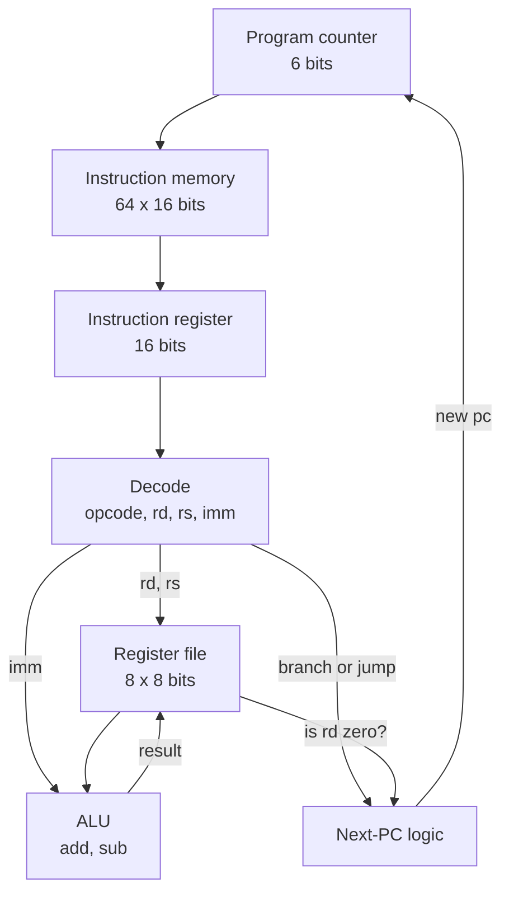

import TawkWidget from '../../../../components/TawkWidget.astro';
import UniversalContentContributors from '../../../../components/UniversalContentContributors.astro';
import InArticleAd from '../../../../components/InArticleAd.astro';
import Copyright from '../../../../components/Copyright.astro';
import BionicText from '../../../../components/BionicText.astro';
import TailwindWrapper from '../../../../components/TailwindWrapper.jsx';
import { Tabs, TabItem } from '@astrojs/starlight/components';
import { Card, CardGrid, Badge, Steps, LinkButton, FileTree } from '@astrojs/starlight/components';

<UniversalContentContributors 
  contributors={frontmatter.contributors}
/>

import FpgaDigitalDesignVerilogComments from '../../../../components/fpga-digital-design-verilog/FpgaDigitalDesignVerilogComments.astro';

You have written code for an STM32 or an ESP32 without ever seeing the thing that executes it. A CPU is the last piece of an embedded system that still feels like magic, and it stops feeling that way the moment you have wired one together yourself. Every part you need, you have already built. #verilog #fpga #cpu

## Learning Objectives

By the end of this lesson, you will be able to:

1. **Define** a minimal instruction set and encode it into fixed-width instruction words.
2. **Design** the datapath: register file, ALU, program counter, and instruction memory.
3. **Build** the control FSM that implements fetch, decode, and execute.
4. **Hand-assemble** a short program and load it into memory.
5. **Run** it on your own processor and verify the result.

## What We Are Building

<InArticleAd />

<Card title="An 8-bit CPU running a real program" icon="star">
  A processor with eight registers and six instructions: load immediate, add, subtract, jump, branch if not zero, and halt. Then a hand-assembled program that loops five times adding three each pass, which you will watch produce 15 and stop.
</Card>

Nothing here is new. The register file is memory from Lesson 6, the ALU is the adder from Lesson 1, the program counter is the counter from Lesson 1, and the control unit is an FSM from Lesson 3. A CPU is not a new kind of circuit. It is an arrangement of the circuits you already have.

## Designing a Tiny Instruction Set

<InArticleAd />

Start from the instructions, because they determine the hardware. Resist adding any you do not need: every opcode costs decode logic, and the point here is to understand the machine, not to compete with ARM.

Six instructions are enough to be Turing-complete in practice:

| Mnemonic | Opcode | Meaning |
|---|:---:|---|
| `LOADI rd, imm` | `0x1` | Put an immediate value into register `rd` |
| `ADD rd, rs` | `0x2` | `rd = rd + rs` |
| `SUB rd, rs` | `0x3` | `rd = rd - rs` |
| `JMP addr` | `0x4` | Jump unconditionally |
| `BNZ rd, addr` | `0x5` | Jump if `rd` is not zero |
| `HALT` | `0xF` | Stop fetching |

`BNZ` is the one that matters. Without a conditional branch you have a calculator; with it you have a computer, because loops and decisions both fall out of it.

### Encoding

Fixed-width instructions keep decode simple. Sixteen bits, split into four fields:

```text title="Instruction format, 16 bits"
 15      12 11    9 8     6 5           0
+----------+-------+-------+-------------+
|  opcode  |  rd   |  rs   |   imm/addr  |
+----------+-------+-------+-------------+
    4 bits   3 bits  3 bits    6 bits
```

Three bits of register field gives eight registers. Six bits of immediate gives values 0 to 63 and addresses into a 64-word program memory. Those are small numbers, chosen so the whole design stays readable.

Extracting the fields is then pure wiring, with no logic at all:

```verilog title="Field extraction"
wire [3:0] opcode = ir[15:12];
wire [2:0] rd     = ir[11:9];
wire [2:0] rs     = ir[8:6];
wire [5:0] imm    = ir[5:0];
```

That is why fixed-width encoding is worth the wasted bits. A variable-length format saves memory and costs you a decoder that has to work out how long each instruction is before it can read it.

## The Datapath

<InArticleAd />

The datapath is everything that holds or moves values. The control FSM in the next section decides when.



Four pieces:

- **Program counter**, 6 bits, holding the address of the next instruction. Normally increments; a jump or taken branch loads a new value instead.
- **Instruction memory**, 64 words of 16 bits. Read-only in this design, which is why it can be initialised from a file.
- **Register file**, eight registers of 8 bits. Two are read and one is written per instruction.
- **ALU**, doing add and subtract. Deliberately minimal; adding AND, OR and shift is a few lines each once the structure works.

Note that `regs` here is written as a plain array indexed by `rd` and `rs`. On an FPGA a small register file like this maps to distributed LUT RAM rather than block RAM, because it needs two simultaneous combinational reads, and block RAM cannot do that. This is the exception to the block RAM rule from Lesson 6.

## The Control FSM: Fetch, Decode, Execute

<InArticleAd />

This is where Lesson 3 pays off. The CPU is a three-state machine, and every instruction walks the same loop.

<Steps>

1. **Fetch.** Read the instruction at `pc` into the instruction register.

2. **Decode.** Give the fetched word a cycle to settle, and let the field extraction present opcode, registers and immediate.

3. **Execute.** Do what the opcode says, write any result into the register file, and set the next `pc`.

</Steps>

```verilog title="mini_cpu.v"
// Instruction format: [15:12] opcode, [11:9] rd, [8:6] rs, [5:0] imm/addr
module mini_cpu (
    input  wire       clk,
    input  wire       rst,
    output wire [7:0] acc_out,      // register 0, exposed for inspection
    output wire [5:0] pc_out,
    output wire       halted
);
    localparam [3:0] OP_LOADI = 4'h1,  // rd <- imm
                     OP_ADD   = 4'h2,  // rd <- rd + rs
                     OP_SUB   = 4'h3,  // rd <- rd - rs
                     OP_JMP   = 4'h4,  // pc <- addr
                     OP_BNZ   = 4'h5,  // if rd != 0, pc <- addr
                     OP_HALT  = 4'hF;

    localparam [1:0] S_FETCH = 2'd0, S_DECODE = 2'd1, S_EXEC = 2'd2, S_HALT = 2'd3;

    reg [15:0] imem [0:63];
    reg [7:0]  regs [0:7];
    reg [5:0]  pc;
    reg [15:0] ir;
    reg [1:0]  state;

    wire [3:0] opcode = ir[15:12];
    wire [2:0] rd     = ir[11:9];
    wire [2:0] rs     = ir[8:6];
    wire [5:0] imm    = ir[5:0];

    assign acc_out = regs[0];
    assign pc_out  = pc;
    assign halted  = (state == S_HALT);

    initial $readmemh("program.hex", imem);

    always @(posedge clk) begin
        if (rst) begin
            pc <= 0; state <= S_FETCH; ir <= 0;
            regs[0] <= 0; regs[1] <= 0; regs[2] <= 0; regs[3] <= 0;
            regs[4] <= 0; regs[5] <= 0; regs[6] <= 0; regs[7] <= 0;
        end else begin
            case (state)
                S_FETCH: begin
                    ir    <= imem[pc];
                    state <= S_DECODE;
                end

                S_DECODE: state <= S_EXEC;   // let the fetched word settle

                S_EXEC: begin
                    state <= S_FETCH;
                    case (opcode)
                        OP_LOADI: begin regs[rd] <= {2'b00, imm};        pc <= pc + 1'b1; end
                        OP_ADD:   begin regs[rd] <= regs[rd] + regs[rs]; pc <= pc + 1'b1; end
                        OP_SUB:   begin regs[rd] <= regs[rd] - regs[rs]; pc <= pc + 1'b1; end
                        OP_JMP:   pc <= imm;
                        OP_BNZ:   pc <= (regs[rd] != 8'd0) ? imm : pc + 1'b1;
                        OP_HALT:  state <= S_HALT;
                        default:  pc <= pc + 1'b1;
                    endcase
                end

                S_HALT: state <= S_HALT;
            endcase
        end
    end
endmodule
```

Several design decisions are visible in there.

**Why a separate decode state?** With instruction memory read synchronously, `ir` is only valid the cycle *after* `S_FETCH`. Executing immediately would decode whatever `ir` held from the previous instruction. This is the block RAM read latency from Lesson 6, appearing exactly where you were warned it would.

**Why does `pc` advance in execute, not fetch?** Because a branch has to be able to override it. If fetch incremented `pc` unconditionally, `BNZ` would have to undo that, and the two writers would fight. One writer, one place, in the state that knows the answer.

**Why is `S_HALT` a trap state?** `state <= S_HALT` with no exit means the only way out is reset. That is the correct behaviour for a halted processor, and it makes `halted` a clean signal for a testbench to wait on.

**Why the `default` branch?** An undefined opcode advances `pc` rather than hanging. Lesson 3's rule about always having a default, applied where it prevents a lock-up.

Three cycles per instruction is not fast. A real core overlaps them in a pipeline so that on average one instruction completes per cycle, which brings hazards, stalls and forwarding. That is the natural next thing to build once this one runs, and it is a much easier step from working hardware than from a diagram.

## Writing and Loading a Program

<InArticleAd />

Now write software for hardware you designed. The program computes five times three by repeated addition:

```text title="The program"
addr  instruction        meaning
  0   LOADI r1, 5        loop counter
  1   LOADI r0, 0        accumulator
  2   LOADI r2, 3        the value to add
  3   LOADI r3, 1        the constant 1, for decrementing
  4   ADD   r0, r2       r0 = r0 + 3        <-- loop body
  5   SUB   r1, r3       r1 = r1 - 1
  6   BNZ   r1, 4        if r1 != 0, go back to 4
  7   HALT
```

Note instruction 3. There is no "subtract immediate", so decrementing needs the constant 1 in a register first. That kind of constraint is exactly what an instruction set imposes on the software written for it, and feeling it from the inside is half the value of this exercise.

### Assembling by hand

Each instruction packs into 16 bits by shifting each field into place:

```python title="assemble.py"
def enc(op, rd=0, rs=0, imm=0):
    return (op << 12) | (rd << 9) | (rs << 6) | imm

prog = [
    enc(0x1, rd=1, imm=5),    # 0: LOADI r1, 5
    enc(0x1, rd=0, imm=0),    # 1: LOADI r0, 0
    enc(0x1, rd=2, imm=3),    # 2: LOADI r2, 3
    enc(0x1, rd=3, imm=1),    # 3: LOADI r3, 1
    enc(0x2, rd=0, rs=2),     # 4: ADD r0, r2
    enc(0x3, rd=1, rs=3),     # 5: SUB r1, r3
    enc(0x5, rd=1, imm=4),    # 6: BNZ r1, 4
    enc(0xF),                 # 7: HALT
]

with open('program.hex', 'w') as f:
    f.write('\n'.join(f'{w:04x}' for w in prog) + '\n')
```

That produces one hex word per line, which is exactly the format `$readmemh` expects:

```text title="program.hex"
1205
1000
1403
1601
2080
32c0
5204
f000
```

Take a moment over `5204`, the `BNZ`. Opcode 5, `rd` field 1, `rs` field 0, immediate 4. In binary that is `0101 001 000 000100`, and reading it back off the bit fields is the clearest possible demonstration that machine code is not mysterious, just packed.

### Running it

```verilog title="Excerpt from the testbench"
mini_cpu cpu (.clk(clk), .rst(rst), .acc_out(acc), .pc_out(pc), .halted(halted));

initial begin
    cycles = 0; #20 rst = 0;
    while (!halted && cycles < 500) begin @(posedge clk); cycles = cycles + 1; end
    $display("halted after %0d cycles at pc=%0d", cycles, pc);
    $display("r0 = %0d (expected 15)", acc);
end
```

```text title="Simulation output"
halted after 61 cycles at pc=7
r0 = 15 (expected 15: five iterations of +3)  PASS
```

Sixty-one cycles for twenty instructions executed, at three cycles each plus reset overhead. Your processor ran your program and got the right answer.

You will also see a harmless warning, because the program is shorter than the memory:

```text title="Expected warning"
WARNING: $readmemh(program.hex): Not enough words in the file for the requested range [0:63].
```

Note also the watchdog in that testbench, `cycles < 500`. A CPU with a branch bug loops forever, and a bounded testbench fails in a second rather than hanging your terminal. Always bound a test that waits on a condition the design under test controls.

:::tip[Instrument it]
A CPU you built yourself is the perfect thing to make observable. Bring the program counter and a few control signals out to pins or LEDs so you can literally watch fetch, decode, and execute step through your program, this is the clearest debugging aid you will have. Driven slowly from a button, single-stepping the clock turns the abstract cycle into something you can see. The same exposed PC and status lines are what an [external monitor](https://siliconwit.io) would later read to confirm the core is alive and progressing.
:::

## Application Questions and Solutions

<InArticleAd />

### Question 1: The program counter never advances

After loading a program, the CPU sits with the program counter stuck at zero. Where do you look first?

<details>
<summary>**Click to reveal the solution**</summary>

<Steps>

1. **Check the control FSM.** A stuck program counter usually means the fetch state never asserts the signal that increments it, or the FSM is not leaving the reset or fetch state. ✅

2. **Confirm the clock and reset.** Verify the core is actually clocked and that reset is released. A held reset looks exactly like a stuck PC. ✅

3. **Check the program actually loaded.** If `$readmemh` could not find the file, `imem` is all `x`, the opcode is `x`, no `case` branch matches, and with a `default` that does nothing the machine sits still. The simulator prints a warning about the missing file, which is easy to scroll past. ✅

4. **Trace one cycle in simulation** with a waveform, watching the state, the PC enable, and the instruction fetched, until the first increment happens. ✅

</Steps>

</details>

### Question 2: The loop runs one time too many

A learner changes `BNZ` to branch while the counter is not *negative* rather than not zero, expecting the same behaviour, and the loop runs forever. Using the program above, explain what happened.

<details>
<summary>**Click to reveal the solution**</summary>

<Steps>

1. **Ask what "negative" means here.** The registers are 8 bits and this ALU has no sign convention, so values are unsigned 0 to 255. There is no negative. ✅

2. **Follow the counter down.** `r1` goes 5, 4, 3, 2, 1, 0. With a not-zero test the loop exits at 0. With a not-negative test, 0 still passes, so it decrements again. ✅

3. **See the wrap.** 0 minus 1 in 8-bit unsigned arithmetic is 255, not negative one. The counter now has 255 more iterations before it reaches 0 again, and the not-negative test never becomes false, so it loops forever. ✅

4. **Draw the general lesson.** Comparisons on a fixed-width unsigned value behave differently from comparisons on a mathematical integer. This is the same wrap you saw in the 4-bit counter in Lesson 1, appearing where it is far more expensive. ✅

</Steps>

</details>

### Question 3: Why three cycles per instruction, and how would you cut it?

The design takes three cycles for every instruction. A colleague suggests merging decode into fetch to get it to two. What breaks, and what is the right way to go faster?

<details>
<summary>**Click to reveal the solution**</summary>

<Steps>

1. **Identify why decode exists.** Instruction memory has a registered read, so the fetched word is not available until the cycle after the address is presented. Merging the states would decode stale data. ✅

2. **Note the one case where it would work.** If instruction memory were combinational, using distributed LUT RAM instead of block RAM, `ir` would be valid immediately and two cycles would be enough. That trades memory efficiency for a cycle, and only works while the program is small. ✅

3. **Understand the real answer: pipelining.** Rather than making each instruction shorter, overlap them, so while one executes the next is decoding and a third is being fetched. Throughput approaches one instruction per cycle without any single instruction getting faster. ✅

4. **Name the cost.** Pipelining introduces hazards. A branch means instructions already fetched must be discarded, and an instruction reading a register the previous one is still writing needs stalling or forwarding. That complexity is why the simple version is worth building first. ✅

</Steps>

</details>

## Summary

<InArticleAd />

| Concept | Key Takeaway |
|---------|--------------|
| Instruction set first | The instructions determine the hardware, so design them before any Verilog |
| Conditional branch | `BNZ` is what turns a calculator into a computer |
| Fixed-width encoding | Field extraction becomes pure wiring, with no decode logic at all |
| Datapath | PC, instruction memory, register file, ALU. All built in earlier lessons |
| Register file | Needs two combinational reads, so it maps to LUT RAM, not block RAM |
| Why decode exists | Registered memory read means `ir` is valid a cycle after fetch |
| One writer per register | `pc` is set only in execute, so branches can override cleanly |
| Halt as a trap state | No exit except reset. Gives a testbench a clean thing to wait on |
| `default` branches | An unknown opcode advances rather than hanging |
| Bound your testbench | A branch bug loops forever. A cycle limit fails in a second instead |
| Unsigned wrap | 0 minus 1 is 255, not negative one. Comparisons are not integer comparisons |
| Going faster | Pipelining overlaps instructions. Merging fetch and decode just reads stale data |

You have built a processor. The remaining question is not how to build a bigger one, but when a processor is the wrong answer, which is exactly what the next lesson is about.

:::tip[Next Lesson]
In [Lesson 8: FPGA and MCU Co-design](/education/fpga-digital-design-verilog/fpga-mcu-codesign), you will partition a real system between an FPGA and a microcontroller, build the interface between them, and learn to recognise when an FPGA is genuinely the wrong tool.
:::

<FpgaDigitalDesignVerilogComments />

<InArticleAd />
<TawkWidget />
<Copyright />
