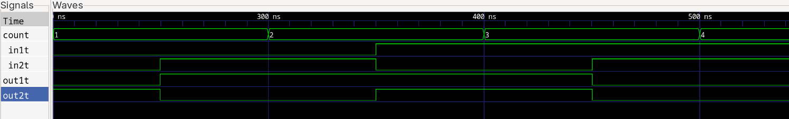

import TawkWidget from '../../../../components/TawkWidget.astro';
import UniversalContentContributors from '../../../../components/UniversalContentContributors.astro';
import InArticleAd from '../../../../components/InArticleAd.astro';
import Copyright from '../../../../components/Copyright.astro';
import BionicText from '../../../../components/BionicText.astro';
import TailwindWrapper from '../../../../components/TailwindWrapper.jsx';
import { Tabs, TabItem } from '@astrojs/starlight/components';
import { Card, CardGrid, Badge, Steps, LinkButton, FileTree } from '@astrojs/starlight/components';

<UniversalContentContributors 
  contributors={frontmatter.contributors}
/>


import FpgaDigitalDesignVerilogComments from '../../../../components/fpga-digital-design-verilog/FpgaDigitalDesignVerilogComments.astro';

A logic bug on a breadboard costs you a rewire. The same bug in a chip costs a respin, months of calendar time, and a conversation nobody wants to have. That gap is why hardware engineers prove designs correct in simulation before committing them to anything physical, and why a testbench is part of the design rather than an afterthought. #verilog #verification #simulation

## Learning Objectives

By the end of this lesson, you will be able to:

1. **Structure** a Verilog testbench: clock generation, stimulus, and result checking.
2. **Write** self-checking tests so the simulator reports pass or fail without you reading every value.
3. **Dump** signals to a waveform file and inspect them in GTKWave.
4. **Diagnose** a failing design from its waveform alone.
5. **Explain** why constructs like `#50` and `$display` belong only in a testbench.

## What We Are Building

<InArticleAd />


<Card title="Self-checking testbenches for the adder and the counter" icon="star">
  You will wrap the 4-bit adder from Lesson 1 in a testbench that walks every input combination, compares each result against an independent reference, and prints one clear pass or fail line. Then you will do the same for the counter, and finish by diagnosing planted bugs.
</Card>

## Why Simulate at All

<InArticleAd />


In software you run the program. In hardware there is nothing to run until something physical exists, and getting to something physical is slow. Even on an FPGA, where reprogramming takes seconds rather than months, the board tells you almost nothing about *why* a design failed. An LED is either lit or it is not.

Simulation gives you three things a board cannot:

- **Total visibility.** Every internal signal, every clock cycle, all recorded.
- **Total control.** You choose exactly what the inputs do, including cases that are rare or awkward in the real world.
- **Repeatability.** A failing case fails identically every time, which is what makes debugging tractable at all.

The price is that a simulator is not hardware. It will faithfully execute things no circuit can do, and that freedom is exactly what makes testbenches possible.

## Anatomy of a Testbench

<InArticleAd />


A testbench is an ordinary Verilog module with one unusual property: **it has no ports.** Nothing drives it, because it sits at the top of the hierarchy. Its job is to instantiate the thing being tested, drive its inputs, and watch its outputs.

The design being tested is called the **DUT** (design under test) or **UUT** (unit under test). Both names are in common use.

Every testbench has the same five parts:

<Steps>

1. **Declare the testbench module**, with an empty port list.

2. **Declare signals** to connect to the DUT. Anything you drive is a `reg`, anything you observe is a `wire`.

3. **Instantiate the DUT** and connect your signals to its ports.

4. **Apply stimulus** in an `initial` block, generating a clock if the design needs one.

5. **Check the results**, ideally by comparing against expected values rather than reading them.

</Steps>

Here is that skeleton:

```verilog title="tb_skeleton.v"
`timescale 1ns/1ps

module tb_skeleton;

    // Signals: reg for inputs you drive, wire for outputs you watch
    reg  a, b;
    wire y;

    // Instantiate the design under test
    my_design dut (
        .a(a),
        .b(b),
        .y(y)
    );

    // Stimulus
    initial begin
        a = 0; b = 0;
        #10 a = 1;
        #10 b = 1;
        #10 $finish;
    end

endmodule
```

### The timescale directive

```verilog
`timescale 1ns/1ps
```

This says a bare `1` in a delay means one nanosecond, and timing rounds to picoseconds. Without it, the meaning of `#10` is left to the simulator and your delays stop being portable. Put it at the top of every testbench.

### Delays and ending a simulation

`#10` means "wait ten time units." It exists only in simulation, because no gate waits. The same applies to `$finish`, `$display`, `$monitor` and `$dumpfile`: anything with a `$` is a command to the simulator, not a description of hardware.

`$finish` matters more than it looks. Without it, a testbench with a running clock never ends and your simulation spins until you kill it.

## Generating Stimulus

<InArticleAd />


### A clock

Any sequential design needs one. The idiom is a `forever` loop with a half-period delay:

```verilog title="Clock generation"
reg clk;

initial begin
    clk = 0;
    forever #5 clk = ~clk;   // toggles every 5ns, so a 10ns period, 100 MHz
end
```

Note that it is a **half** period. A full cycle takes two toggles, so `#5` gives 10 ns, not 5 ns. Getting this backwards is common and confusing, because everything still works, just at half the frequency you intended.

### Reset, then data

Sequential designs must start from a known state. Assert reset, hold it across at least one clock edge, then release:

```verilog title="Reset sequence"
initial begin
    reset = 1;
    #20;            // hold through two clock edges at 10ns period
    reset = 0;
end
```

### Walking through input combinations

For combinational logic with few inputs, test all of them. An array of test vectors reads clearly and extends easily:

```verilog title="first_system_tb.v"
`timescale 1ns/1ps
`include "first_system.v"

module first_system_tb;

// Inputs
reg in1t, in2t;

// Outputs
wire out1t, out2t;

// Instantiate the Unit Under Test (UUT)
first_system UUT (
    .out1(out1t),
    .out2(out2t),
    .in1(in1t),
    .in2(in2t)
);

reg [1:0] Testset [3:0];

integer count;

// Providing input to the UUT
initial begin
    // Create VCD file for waveform viewing
    $dumpfile("first_system.vcd");
    $dumpvars(0, first_system_tb);

    // Initialize test vectors
    Testset[0] = 2'b00;
    Testset[1] = 2'b01;
    Testset[2] = 2'b10;
    Testset[3] = 2'b11;

    #100;

    count = 0;
    repeat (4)
    begin
        #50 {in1t, in2t} = Testset[count];
        #50 count = count + 1;
    end

    #50 $finish;
end

// Display the result on the console (optional)
initial begin
    $display("================================");
    $display("  in1  in2  |  out1  out2");
    $display("================================");
    $monitor("  %b    %b    |   %b     %b", in1t, in2t, out1t, out2t);
end

endmodule
```

Two constructs worth naming. `reg [1:0] Testset [3:0]` declares an **array** of four two-bit values, which is memory in simulation and needs no hardware. And `{in1t, in2t} = Testset[count]` uses the **concatenation** operator `{}` to assign both signals from one two-bit value at once.

Running it against the `first_system` module from Lesson 1 gives:

| `in1` | `in2` | `out1` | `out2` |
| :---: | :---: | :---: | :---: |
| 0 | 0 | 0 | 1 |
| 0 | 1 | 1 | 0 |
| 1 | 0 | 1 | 1 |
| 1 | 1 | 0 | 0 |

### Printing values: display versus monitor

`$display` prints once, when execution reaches it. `$monitor` is armed once and then prints automatically whenever any of its arguments changes. One `$monitor` over the interesting signals often replaces a dozen `$display` calls.

Useful format specifiers: `%b` binary, `%d` decimal, `%h` hex, `%0t` simulation time, `%s` string. The `0` in `%0d` and `%0t` drops the padding, which makes output far easier to read.

## Self-Checking with Assertions

<InArticleAd />


Everything so far prints a table for a human. That does not scale. Four combinations you can check by eye, sixteen you will skim, two hundred you will not read at all, which means a regression walks straight past you.

A **self-checking** testbench computes the answer itself and compares:

```verilog title="adder4_tb.v"
`timescale 1ns/1ps

module adder4_tb;

    reg  [3:0] a, b;
    reg        cin;
    wire [3:0] sum;
    wire       cout;

    integer i, j;
    integer errors;
    reg [4:0] expected;      // 5 bits: four sum bits plus carry out

    adder4 dut (
        .a(a), .b(b), .cin(cin),
        .sum(sum), .cout(cout)
    );

    initial begin
        $dumpfile("adder4.vcd");
        $dumpvars(0, adder4_tb);

        errors = 0;
        cin    = 0;

        // Exhaustive over both 4-bit inputs: 256 combinations
        for (i = 0; i < 16; i = i + 1) begin
            for (j = 0; j < 16; j = j + 1) begin
                a = i[3:0];
                b = j[3:0];
                #5;                          // let the logic settle

                expected = i + j;            // independent reference answer

                if ({cout, sum} !== expected) begin
                    errors = errors + 1;
                    $display("FAIL  a=%0d b=%0d  got %0d  expected %0d",
                             a, b, {cout, sum}, expected);
                end
            end
        end

        if (errors == 0)
            $display("PASS  all 256 combinations correct");
        else
            $display("FAIL  %0d of 256 combinations wrong", errors);

        $finish;
    end

endmodule
```

Run it and you get a single line:

```text title="Simulation output"
PASS  all 256 combinations correct
```

That is the shape to reach for. Every case tested, one line of verdict, and on failure it names the exact inputs that broke it.

Three details that matter more than they look:

- **`!==` rather than `!=`.** The four-state comparison also catches `x` (unknown) and `z` (high impedance). Plain `!=` returns `x` when either side is unknown, and `x` is not true, so the `else` branch runs and your test reports success on a completely undriven output. Use `!==` in testbenches.
- **The reference is independent.** `expected = i + j` uses the simulator's own arithmetic, not your adder. A reference model that shares logic with the design shares its bugs.
- **`#5` before checking.** Combinational output needs simulation time to settle after inputs change. Check too early and you read the previous value.

### Checking a sequential design

For the counter, the property worth testing is that it advances by exactly one per clock edge and wraps cleanly:

```verilog title="counter_4bit_tb.v"
`timescale 1ns/1ps

module counter_4bit_tb;

    reg clk;
    reg reset;
    wire [3:0] count;

    reg [3:0] expected;
    integer   errors;

    counter_4bit uut (
        .clk(clk),
        .reset(reset),
        .count(count)
    );

    // Clock generation: 10ns period
    initial begin
        clk = 0;
        forever #5 clk = ~clk;
    end

    initial begin
        $dumpfile("counter_4bit.vcd");
        $dumpvars(0, counter_4bit_tb);

        errors  = 0;
        reset   = 1;
        #20;
        reset    = 0;
        expected = 0;

        // 20 edges, which carries it past the wrap at 15
        repeat (20) begin
            @(posedge clk);
            #1;                          // settle after the edge
            expected = expected + 1;
            if (count !== expected) begin
                errors = errors + 1;
                $display("FAIL  t=%0t  got %0d  expected %0d",
                         $time, count, expected);
            end
        end

        if (errors == 0) $display("PASS  counter advanced correctly through wrap");
        else             $display("FAIL  %0d mismatches", errors);

        $finish;
    end

endmodule
```

`@(posedge clk)` is an **event control**: it pauses until the next rising edge. It is far more robust than counting delays by hand, because it stays correct when you change the clock period.

The `#1` after the edge matters. At the exact instant of an edge, whether you observe the old or new value of `count` is a race. Waiting a nanosecond puts you safely after the flip-flop has settled.

Note that `expected` is only four bits wide, so it wraps at 15 exactly as the counter does. That is deliberate: the test confirms the wrap rather than flagging it as an error.

## Dumping and Reading Waveforms

<InArticleAd />


A pass or fail line tells you *that* something broke. A waveform tells you *why*.

```verilog title="Waveform dumping"
initial begin
    $dumpfile("design.vcd");     // the output file
    $dumpvars(0, tb_module);     // 0 means all levels below tb_module
end
```

`$dumpvars(0, tb_module)` records everything, including signals inside the DUT, which is what you want while debugging. A smaller depth records less, and only matters on large designs where VCD files grow quickly.

Then run the loop:

```bash title="Compile, run, view"
iverilog -o counter_4bit_tb.vvp counter_4bit_tb.v counter_4bit.v
vvp counter_4bit_tb.vvp
gtkwave counter_4bit.vcd
```

Note that both files are listed. Icarus needs the design as well as the testbench. The alternative is an `` `include "counter_4bit.v" `` line at the top of the testbench, as in `first_system_tb.v` above. Pick one convention and stay with it, because doing both gives you duplicate module definitions and a confusing error.



*Figure: the counter advancing one step per clock edge, viewed in GTKWave*

### Reading a trace

In GTKWave, drag signals from the hierarchy pane into the wave pane. A few habits make traces far easier to read:

- **Put the clock at the top.** Everything is measured against it.
- **Put reset next.** Most confusing early traces turn out to be reset behaving differently from how you assumed.
- **Group buses** and display them in hex or decimal rather than as loose bits.
- **Read edge by edge.** At each rising edge, ask what the inputs to a flip-flop were *just before* the edge. That, not the value after, determined the new state.

That last habit is the whole skill. Sequential bugs are almost always a signal arriving one cycle later, or earlier, than you assumed.

## Application Questions and Solutions

<InArticleAd />


### Question 1: Why did the sum look correct but the carry was wrong?

A learner reports that their adder testbench shows the correct `sum` but `cout` is always zero. The waveform shows `cout` flat across every input. What is the likely cause and how would you confirm it?

<details>
<summary>**Click to reveal the solution**</summary>

<Steps>

1. **Read the waveform first.** A signal that never changes usually means it is undriven or stuck, not miscomputed. ✅

2. **Check the connection.** The most common cause is that `cout` was declared but never connected to the adder instance, so it floats. Trace the port mapping. ✅

3. **Note the tell in the failure pattern.** `cout` only matters when the result exceeds 15, so a fault here shows up as a failure that correlates with input magnitude. In an arithmetic circuit, that pattern points at the carry path. ✅

4. **Confirm in simulation.** After fixing the connection, re-run and verify `cout` goes high exactly when the 4-bit sum overflows. The 256-combination loop covers every carry case, so a pass is meaningful. ✅

</Steps>

</details>

### Question 2: Why does this testbench report success on a broken design?

```verilog title="weak_tb.v"
initial begin
    a = 4'd3; b = 4'd4;
    if (sum != 4'd7) $display("FAIL");
    else             $display("PASS");
    $finish;
end
```

Give three separate reasons this test cannot be trusted.

<details>
<summary>**Click to reveal the solution**</summary>

<Steps>

1. **No settling time.** The check runs in the same simulation instant as the assignment, so `sum` still holds its previous value, or `x` at time zero. A `#5` before the comparison fixes it. ✅

2. **`!=` instead of `!==`.** If `sum` is `x`, then `sum != 4'd7` evaluates to `x`, which is not true, so the `else` branch runs and the test prints PASS on an undriven output. ✅

3. **One vector proves almost nothing.** Passing for 3 plus 4 says nothing about carry behaviour, the wrap at 15, or `cin`. Exhaustive testing costs 256 cases here, so there is no excuse. ✅

4. **A fourth, for credit.** The verdict is printed regardless of how many checks ran, so a test that silently does nothing still says PASS. Counting errors and reporting the count makes that visible. ✅

</Steps>

</details>

### Question 3: The design simulates perfectly and fails on the board

A design passes every test. On the FPGA it does not work at all. The clocked block looks like this:

```verilog title="not_synthesisable.v"
always @(posedge clk) begin
    #5 count <= count + 1;
end
```

What is wrong?

<details>
<summary>**Click to reveal the solution**</summary>

<Steps>

1. **Spot the simulation-only construct.** `#5` is a delay. It exists in the simulator and has no hardware equivalent. ✅

2. **Understand what the tools do with it.** Synthesis ignores delays, usually with a warning that is easy to miss. So the hardware built is not the hardware you simulated, and the simulation was never a valid prediction of it. ✅

3. **Recognise the category.** `#`, `$display`, `$monitor`, `$dumpfile`, `initial` blocks and `forever` loops all belong in testbenches only. Design code should contain none of them. ✅

4. **Fix it** by deleting the delay. Timing in real hardware comes from the clock, not from written delays. ✅

</Steps>

The habit that prevents this: keep testbench files and design files clearly separate, and never move a construct from one to the other without asking whether it can be built from gates.

</details>

## Summary

<InArticleAd />


| Concept | Key Takeaway |
|---------|--------------|
| Testbench | A port-less module that instantiates the DUT, drives it, and checks it |
| `timescale` | Declares what a bare delay number means. Put it in every testbench |
| Clock idiom | `forever #5 clk = ~clk;` gives a 10 ns period. The delay is a half period |
| Self-checking | Compare against an independent reference and count errors. Do not eyeball tables |
| `!==` versus `!=` | Four-state comparison catches `x` and `z`. Plain `!=` hides undriven signals |
| Settling time | Wait before checking combinational output, and `#1` past an edge before checking a register |
| `@(posedge clk)` | Waits for an edge. More robust than hand-counted delays |
| Not synthesisable | `#`, `$display`, `$monitor`, `initial`, `forever`. Testbench only, never design |
| Waveform dump | `$dumpfile` plus `$dumpvars`, then GTKWave. Read edge by edge |
| Debugging | A flat signal usually means undriven, not miscomputed |

You can now prove a design correct before it exists physically, which is the discipline that makes everything after this affordable. Next you apply it to the most important sequential building block there is.

:::tip[Next Lesson]
In [Lesson 3: State Machines in Verilog](/education/fpga-digital-design-verilog/state-machines-verilog), you will design circuits that remember where they are, starting with a traffic-light controller, and use the testbench skills from this lesson to verify their behaviour over time.
:::

<FpgaDigitalDesignVerilogComments />


<InArticleAd />
<TawkWidget />
<Copyright />