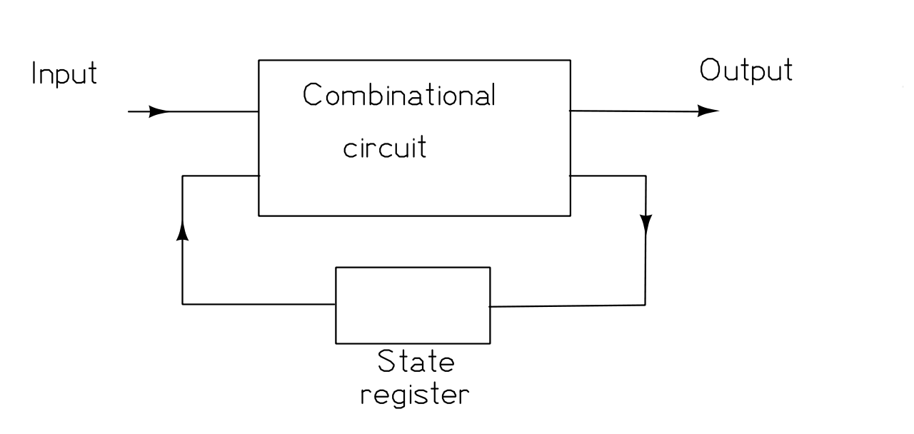
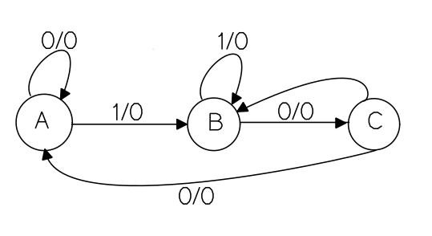
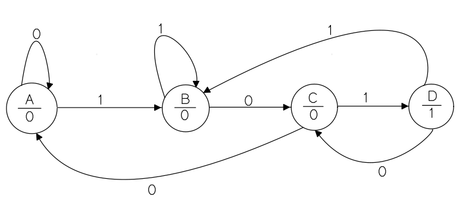

import TawkWidget from '../../../../components/TawkWidget.astro';
import UniversalContentContributors from '../../../../components/UniversalContentContributors.astro';
import InArticleAd from '../../../../components/InArticleAd.astro';
import Copyright from '../../../../components/Copyright.astro';
import BionicText from '../../../../components/BionicText.astro';
import TailwindWrapper from '../../../../components/TailwindWrapper.jsx';
import { Tabs, TabItem } from '@astrojs/starlight/components';
import { Card, CardGrid, Badge, Steps, LinkButton, FileTree } from '@astrojs/starlight/components';

<UniversalContentContributors 
  contributors={frontmatter.contributors}
/>


import FpgaDigitalDesignVerilogComments from '../../../../components/fpga-digital-design-verilog/FpgaDigitalDesignVerilogComments.astro';

A combinational circuit always gives the same output for the same input. But a traffic light, a vending machine, and a communication protocol all behave differently depending on what happened before. They have state. The finite state machine is the tool digital designers use to describe that behaviour cleanly and turn it into reliable hardware. #verilog #fsm #digitaldesign

{/* CONTRIBUTOR NOTE
   Goal: the reader can design and code an FSM in the clean two-block style and verify it.
   Keep all headings. Rules: no em dashes; titled code blocks; code out of <Steps>; no `$` for currency.
*/}

## Learning Objectives

By the end of this lesson, you will be able to:

1. **Draw** a state diagram for a sequential problem and translate it to Verilog.
2. **Compare** Moore and Mealy machines and choose the right one.
3. **Explain** binary versus one-hot state encoding and the trade-off on an FPGA.
4. **Code** an FSM in the clean two-block (or three-block) style and verify it with a testbench.

## What We Are Building

<InArticleAd />


<Card title="A traffic-light controller and a protocol decoder" icon="star">
  You will build a traffic-light controller as a Moore machine with timed states, then a small serial-protocol decoder that recognises a start sequence, as a second, more demanding FSM.
</Card>

## What a Finite State Machine Is

<InArticleAd />


{/* CONTRIBUTOR: define states, transitions, inputs, outputs. Draw or embed a simple state diagram. */}

## Moore versus Mealy

<InArticleAd />


{/* CONTRIBUTOR: Moore output depends only on state; Mealy output depends on state and input.
   Give the practical consequence (timing, glitches) and when each is preferred. */}

## State Encoding: Binary versus One-Hot

<InArticleAd />


{/* CONTRIBUTOR: explain how the encoding maps to flip-flops and why one-hot is often a good fit on
   FPGAs (abundant flip-flops, simpler next-state logic). Mention `localparam` for state names. */}

## The Two-Block Coding Style

<InArticleAd />


{/* CONTRIBUTOR: show the recommended structure: one clocked always block for the state register,
   one combinational always block for next-state and output logic. This is the heart of the lesson. */}

```verilog title="traffic_light.v"
module traffic_light (
    input  wire clk,
    input  wire rst,
    output reg  [1:0] light   // 00 red, 01 green, 10 yellow
);
    localparam RED = 2'd0, GREEN = 2'd1, YELLOW = 2'd2;
    reg [1:0] state, next_state;

    // CONTRIBUTOR: state register block (clocked) and next-state block (combinational) go here
endmodule
```

## Application Questions and Solutions

<InArticleAd />


### Question 1: A state machine that locks up after reset

An FSM works in simulation but, on power-up without an explicit reset, it sometimes freezes and never leaves its first state. What design habit prevents this?

<details>
<summary>**Click to reveal the solution**</summary>

<Steps>

1. **Identify the cause.** Without a reset, the state register can power up in an undefined or unreachable state, with no transition out of it. ✅

2. **Add a synchronous reset** that forces a known starting state, and make sure every defined state has a path back toward normal operation. ✅

3. **Add a default branch** in the next-state logic so any unexpected state value returns to a safe state rather than sticking. ✅

</Steps>

</details>

## Summary

<InArticleAd />


| Concept | Key Takeaway |
|---------|--------------|
| FSM | States, transitions, and outputs that capture sequential behaviour |
| Moore versus Mealy | Moore output depends on state only, Mealy also on input |
| Encoding | One-hot is often a good fit for FPGAs, binary is compact |
| Two-block style | Separate clocked state register from combinational next-state logic |
| Reset and default | Always provide a reset and a default branch to avoid lock-up |

:::tip[Next Lesson]
In [Lesson 4: First Design on a Real FPGA](/education/fpga-digital-design-verilog/first-fpga-design-ice40), you take a design off the simulator and onto a physical board for the first time, learning the FPGA toolchain, pin constraints, and timing along the way.
:::

<FpgaDigitalDesignVerilogComments />


<InArticleAd />
<TawkWidget />
<Copyright />


# STATE MACHINES

---

## Table of Contents

- [Finite State Machine](#finite-state-machine)
- [Components of a Finite State Machine](#components-of-a-finite-state-machine)
- [Types of Finite State Machines](#types-of-finite-state-machines)
- [Mealy State Machine](#mealy-state-machine)
- [Moore State Machine](#moore-state-machine)
- [Design of a Traffic Light Controller in Verilog](#design-of-a-traffic-light-controller-in-verilog)

---

## FINITE STATE MACHINE

A **Finite State Machine (FSM)** is a sequential circuit that transitions between a finite number of states based on:

- **Current state**
- **Inputs**
- **Outputs**

**Combinational circuits** - The output depends only on the present inputs

**Sequential circuits** - The output depends on the present inputs and the present state of the memory elements.

Synchronous sequential circuits are known as the finite state machines.

A FSM is an abstract model of describing sequential circuits.


*Figure: Finite State Machine*

---

## Components of a Finite State Machine

### Finite States

The finite states are the distinct modes or conditions in the given system. Each state represents a specific behavior or situation of the system.

Each state represents a unique condition or mode of operation.

### State Transitions

A state transition is the change from one state to another. These transitions are triggered by specific inputs, events, or conditions.

### State Diagram

A state diagram is a graphical representation of the finite state machine's behavior, showing all states, transitions, inputs, and outputs.

### Inputs

Inputs are external signals that trigger state transitions in the system. They are the driving force that causes the FSM to change states.

### Outputs

The results produced by the system as per the inputs and current states.

---

## Types of Finite State Machines

There are **two main types** of Finite State Machines (FSMs):

1. **Mealy State Machine**
2. **Moore State Machine**

---

## Mealy State Machine

A **Mealy State Machine** is an FSM where the **outputs depend on both the present inputs AND the present state**.


*Figure: Mealy State Machine*


A Mealy state machine has the combinational logic circuit and state register. The memory element is useful to provide some part of previous outputs and present states as inputs to the combinational logic circuit.

### State Diagram of Mealy State Machine



*Figure: Mealy State Diagram*

We have three states (A,B,C). 
0/0 represents input/output
The arrows represent the transition from one state to another
Example: At state A if our input is 0, the output remains 0 and the state remains at A. 
If our input at state A is 1, the output changes to 0 and we move from state A to state B.


### State Table for Mealy State Machine

| **Present State** | **Input** | **Next State** | **Output** |
| :---: | :---: | :---: | :---: |
| **A** | 0 | A | 0 |
| **A** | 1 | B | 0 |
| **B** | 0 | C | 0 |
| **B** | 1 | B | 0 |
| **C** | 0 | A | 0 |
| **C** | 1 | - | - |

---

## Moore State Machine

A **Moore state machine** is an FSM where its **outputs depend only on the present states**.

There are two parts present in a Moore state machine. These are combinational logic and state register. In this case, the present inputs and present states determine the next states. So, based on next states, the Moore state machine produces the outputs.


*Figure: Moore State machine*

### State Diagram of Moore State Machine



*Figure: Moore State Diagram*


### State Table for Moore State Machine

| **Present State** | **Input** | **Next State** | **Output** |
| :---: | :---: | :---: | :---: |
| **A** | 0 | A | 0 |
| **A** | 1 | B | 0 |
| **B** | 0 | C | 0 |
| **B** | 1 | D | 0 |
| **C** | 0 | A | 0 |
| **C** | 1 | D | 0 |
| **D** | 0 | C | 1 |
| **D** | 1 | B | 1 |


---

## Design of a Traffic Light Controller in Verilog

### Specifications

| **State** | **Red** | **Yellow** | **Green** | **Duration** |
| :--- | :---: | :---: | :---: | :--- |
| **RED** | 1 | 0 | 0 | 5 sec |
| **YELLOW** | 0 | 1 | 0 | 2 sec |
| **GREEN** | 0 | 0 | 1 | 5 sec |

### Verilog Code

```verilog
module traffic_light (
    input  clk,
    input  reset,
    output reg red,
    output reg yellow,
    output reg green
);

    // State encoding
    parameter RED    = 2'b00;
    parameter YELLOW = 2'b01;
    parameter GREEN  = 2'b10;

    // State signals
    reg [1:0] state, next_state;

    // Counter for timing
    reg [25:0] counter;

    // State Register (Sequential)
    always @(posedge clk or posedge reset) begin
        if (reset) begin
            state <= RED;
            counter <= 0;
        end else begin
            state <= next_state;
            counter <= counter + 1;
        end
    end

    // Next State Logic (Combinational)
    always @(*) begin
        case (state)
            RED: begin
                if (counter == 26'd50000000)    // 5 seconds
                    next_state = YELLOW;
                else
                    next_state = RED;
            end
            
            YELLOW: begin
                if (counter == 26'd20000000)    // 2 seconds
                    next_state = GREEN;
                else
                    next_state = YELLOW;
            end
            
            GREEN: begin
                if (counter == 26'd50000000)    // 5 seconds
                    next_state = RED;
                else
                    next_state = GREEN;
            end
            
            default: next_state = RED;
        endcase
    end

    // Output Logic (Moore Machine)
    // Output depends only on the current state
    always @(*) begin
        case (state)
            RED:    {red, yellow, green} = 3'b100;
            YELLOW: {red, yellow, green} = 3'b010;
            GREEN:  {red, yellow, green} = 3'b001;
            default: {red, yellow, green} = 3'b100;
        endcase
    end

endmodule