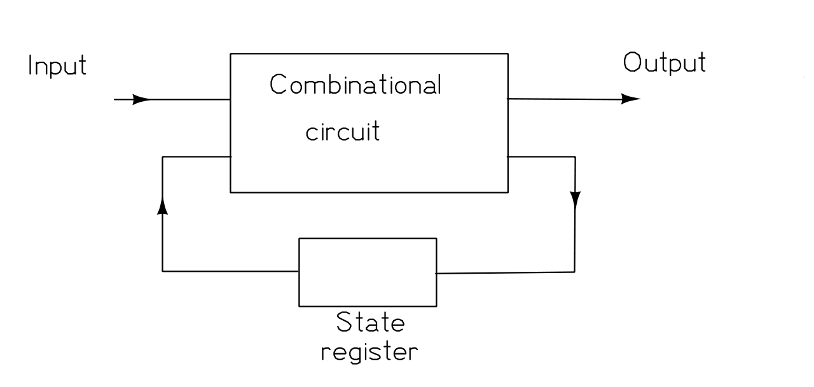
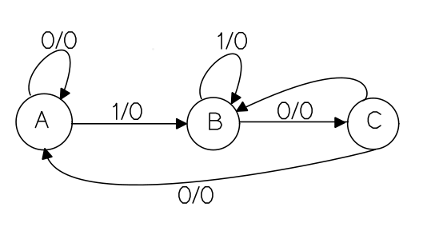
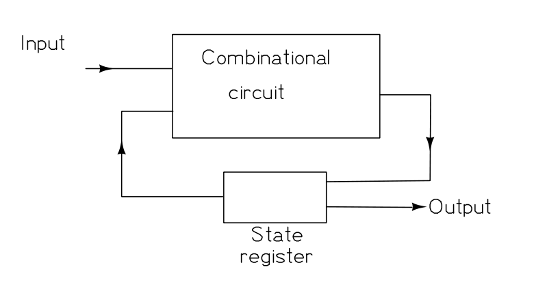
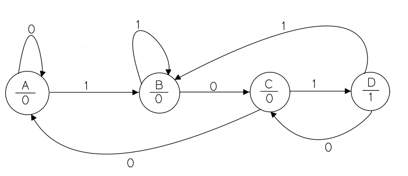

import TawkWidget from '../../../../components/TawkWidget.astro';
import UniversalContentContributors from '../../../../components/UniversalContentContributors.astro';
import InArticleAd from '../../../../components/InArticleAd.astro';
import Copyright from '../../../../components/Copyright.astro';
import BionicText from '../../../../components/BionicText.astro';
import TailwindWrapper from '../../../../components/TailwindWrapper.jsx';
import { Tabs, TabItem } from '@astrojs/starlight/components';
import { Card, CardGrid, Badge, Steps, LinkButton, FileTree } from '@astrojs/starlight/components';

<UniversalContentContributors 
  contributors={frontmatter.contributors}
/>


import FpgaDigitalDesignVerilogComments from '../../../../components/fpga-digital-design-verilog/FpgaDigitalDesignVerilogComments.astro';

An adder answers a question: given these inputs, what is the sum? A traffic light cannot work that way. Its next move depends on where it already is, and how long it has been there. Once a circuit needs to remember, it needs a state machine, and almost every non-trivial digital design is one. #verilog #fsm #digitaldesign

## Learning Objectives

By the end of this lesson, you will be able to:

1. **Identify** the states, transitions, inputs, and outputs of a sequential problem.
2. **Distinguish** Moore from Mealy machines and choose between them deliberately.
3. **Choose** a state encoding and explain the trade-off between binary and one-hot.
4. **Write** an FSM in the two-block style, with a clocked state register and combinational next-state logic.
5. **Build and verify** a traffic-light controller whose states last the intended duration.

## What We Are Building

<InArticleAd />


<Card title="A traffic-light controller that keeps time" icon="star">
  You will write a three-state FSM that cycles red, green, yellow, holding each light for a configured number of clock ticks. Then you will meet the timing bug nearly every first attempt contains, see exactly how wrong it goes in simulation, and fix it.
</Card>

## What a Finite State Machine Is

<InArticleAd />


A finite state machine is a circuit that is always in exactly one of a fixed set of states, and that moves between them according to rules.


*Figure: a finite state machine, with a state register and combinational logic around it*

It has five parts worth naming separately.

### Finite States

The complete list of situations the machine can be in. There must be a finite number of them, hence the name, and the machine is in exactly one at any moment. A traffic light has three: red, green, yellow.

### State Transitions

The moves from one state to another. A transition happens on a clock edge, never between edges. That is what makes the design predictable.

### State Diagram

A drawing with one bubble per state and one arrow per transition, labelled with the condition that causes it. Draw this before writing any Verilog. Almost every FSM bug is visible in a state diagram, and almost none are visible in code you wrote without one.

### Inputs

What the machine looks at when deciding whether to move. A timer expiring, a button press, a byte arriving.

### Outputs

What the machine drives. Which lamp is lit, whether a `busy` flag is high, what value goes on a bus.

## Moore versus Mealy

<InArticleAd />


There are two kinds of FSM, and the difference is only about **where the outputs come from**.

### Mealy State Machine

A Mealy machine's **outputs depend on both the present inputs and the present state**.



*Figure: Mealy machine, with outputs taken from state and input together*

It has combinational logic and a state register. The register holds the present state, and the combinational logic derives both the next state and the outputs from that state plus the current inputs.

#### State Diagram of a Mealy Machine



*Figure: Mealy state diagram, labelled input/output on each arrow*

There are three states, A, B and C. The label `0/0` on an arrow means input/output. So at state A, an input of 0 keeps the output at 0 and stays in A. An input of 1 at state A also gives output 0, but moves to state B.

Notice that the output is written **on the arrow**, not in the bubble. That is the visual signature of a Mealy machine.

#### State Table for a Mealy Machine

| **Present State** | **Input** | **Next State** | **Output** |
| :---: | :---: | :---: | :---: |
| **A** | 0 | A | 0 |
| **A** | 1 | B | 0 |
| **B** | 0 | C | 0 |
| **B** | 1 | B | 0 |
| **C** | 0 | A | 0 |
| **C** | 1 | - | - |

The dash in the last row marks a combination that cannot occur, or that the specification does not define. In real code you still have to decide what happens there, which is why every `case` statement needs a `default`.

### Moore State Machine

A Moore machine's **outputs depend only on the present state**.

There are still two parts, combinational logic and a state register. Present inputs and present state determine the next state, and the output is then derived from the state alone.



*Figure: Moore machine, with outputs taken from the state register only*

#### State Diagram of a Moore Machine



*Figure: Moore state diagram, output written inside each state bubble*

#### State Table for a Moore Machine

| **Present State** | **Input** | **Next State** | **Output** |
| :---: | :---: | :---: | :---: |
| **A** | 0 | A | 0 |
| **A** | 1 | B | 0 |
| **B** | 0 | C | 0 |
| **B** | 1 | D | 0 |
| **C** | 0 | A | 0 |
| **C** | 1 | D | 0 |
| **D** | 0 | C | 1 |
| **D** | 1 | B | 1 |

Look at the last two rows. The output is 1 for both, because both are state D. In a Moore machine the input never appears in the output column, which is exactly the property that makes them easier to reason about.

### Choosing between them

| | Moore | Mealy |
|---|---|---|
| Output depends on | State only | State and input |
| Reacts | One clock later | Immediately |
| Glitches | Cannot, if registered | Possible, since inputs pass through |
| States needed | Often more | Often fewer |
| Easier to verify | Yes | No |

**Default to Moore.** The output is a clean function of a registered value, so it is stable for a whole clock period and cannot glitch. Reach for Mealy when a one-cycle delay genuinely costs you something, for example when you must assert a handshake in the same cycle a request arrives.

## State Encoding: Binary versus One-Hot

<InArticleAd />


States are an idea. Flip-flops are the reality, so the state has to be a number.

**Binary encoding** uses the fewest bits. Three states fit in two bits:

```verilog title="Binary encoding"
localparam [1:0] S_RED = 2'd0, S_GREEN = 2'd1, S_YELLOW = 2'd2;
```

Two flip-flops hold the state. The cost is that decoding "am I in state GREEN?" needs a comparison across both bits, so wide binary state registers grow slow decode logic.

**One-hot encoding** uses one bit per state, with exactly one bit high:

```verilog title="One-hot encoding"
localparam [2:0] S_RED = 3'b001, S_GREEN = 3'b010, S_YELLOW = 3'b100;
```

Three flip-flops now, but testing a state is a single-bit read, and the next-state logic often collapses to almost nothing.

On an FPGA, one-hot is frequently the better trade. Flip-flops are abundant, sitting next to every LUT whether you use them or not, while logic depth is what limits your clock speed. Trading spare flip-flops for shallower logic is usually a win. On an ASIC, where every flip-flop costs area and power, the balance shifts back toward binary.

In practice, write the encoding as named `localparam` values and let the synthesis tool re-encode if it wants to. Most tools do this well, and named constants keep the code readable either way.

Use `localparam` rather than `parameter` for state encodings. A `parameter` can be overridden from outside the module, and nobody should be able to redefine what GREEN means.

## The Two-Block Coding Style

<InArticleAd />


An FSM is easy to write badly. The style below is the one to learn, because it maps directly onto the hardware and it is hard to get subtly wrong.

**Block one is clocked** and does nothing but move the state forward:

```verilog title="Block 1: the state register"
always @(posedge clk) begin
    if (rst) state <= S_RED;
    else     state <= next_state;
end
```

**Block two is combinational** and decides where to go next:

```verilog title="Block 2: next-state logic"
always @(*) begin
    case (state)
        S_RED:    next_state = expired ? S_GREEN  : S_RED;
        S_GREEN:  next_state = expired ? S_YELLOW : S_GREEN;
        S_YELLOW: next_state = expired ? S_RED    : S_YELLOW;
        default:  next_state = S_RED;
    endcase
end
```

A Moore machine adds a **third combinational block** for the outputs, driven from `state` alone:

```verilog title="Block 3: output logic, Moore style"
always @(*) begin
    case (state)
        S_RED:    {red, yellow, green} = 3'b100;
        S_GREEN:  {red, yellow, green} = 3'b001;
        S_YELLOW: {red, yellow, green} = 3'b010;
        default:  {red, yellow, green} = 3'b100;
    endcase
end
```

Four rules that come with the style:

- **`<=` in the clocked block, `=` in the combinational blocks.** The rule from Lesson 1, and it matters most here.
- **Every `case` needs a `default`.** Without it, an unlisted state has no assignment, which infers a latch in combinational logic and can leave the machine stuck.
- **Assign `next_state` on every path.** Same reason. A `case` that assigns nothing in one branch is a latch.
- **Reset to a named state.** Never rely on power-up values.

## Building the Traffic Light Controller

<InArticleAd />


### Specifications

| **State** | **Red** | **Yellow** | **Green** | **Duration** |
| :--- | :---: | :---: | :---: | :--- |
| **RED** | 1 | 0 | 0 | 5 sec |
| **GREEN** | 0 | 0 | 1 | 5 sec |
| **YELLOW** | 0 | 1 | 0 | 2 sec |

Note the order the states run in: red, then green, then yellow, then back to red. Yellow warns that green is ending, so it belongs after green, not before it. Getting the sequence wrong is a specification bug rather than a coding bug, and no amount of Verilog skill will catch it for you. Draw the state diagram first.

### Turning seconds into clock ticks

An FPGA has no notion of seconds, only clock edges. If the board gives you a 27 MHz clock, then five seconds is 135,000,000 ticks. Rather than bury those numbers in the logic, make them parameters:

```verilog title="traffic_light.v"
module traffic_light #(
    parameter integer RED_TICKS    = 50_000_000,
    parameter integer YELLOW_TICKS = 20_000_000,
    parameter integer GREEN_TICKS  = 50_000_000
) (
    input  wire clk,
    input  wire rst,
    output reg  red,
    output reg  yellow,
    output reg  green
);
    localparam [1:0] S_RED = 2'd0, S_GREEN = 2'd1, S_YELLOW = 2'd2;

    reg [1:0]  state, next_state;
    reg [31:0] ticks;
    wire       expired;

    // How long the current state should last
    reg [31:0] limit;
    always @(*) begin
        case (state)
            S_RED:    limit = RED_TICKS;
            S_GREEN:  limit = GREEN_TICKS;
            S_YELLOW: limit = YELLOW_TICKS;
            default:  limit = RED_TICKS;
        endcase
    end

    assign expired = (ticks >= limit - 1);

    // State register, and a tick counter that CLEARS on every state change
    always @(posedge clk) begin
        if (rst) begin
            state <= S_RED;
            ticks <= 0;
        end else if (state != next_state) begin
            state <= next_state;
            ticks <= 0;
        end else begin
            ticks <= ticks + 1;
        end
    end

    // Next-state logic
    always @(*) begin
        case (state)
            S_RED:    next_state = expired ? S_GREEN  : S_RED;
            S_GREEN:  next_state = expired ? S_YELLOW : S_GREEN;
            S_YELLOW: next_state = expired ? S_RED    : S_YELLOW;
            default:  next_state = S_RED;
        endcase
    end

    // Output logic (Moore: depends on state alone)
    always @(*) begin
        case (state)
            S_RED:    {red, yellow, green} = 3'b100;
            S_GREEN:  {red, yellow, green} = 3'b001;
            S_YELLOW: {red, yellow, green} = 3'b010;
            default:  {red, yellow, green} = 3'b100;
        endcase
    end
endmodule
```

The line that carries the whole design is `ticks <= 0` on a state change. Each state then measures **elapsed** time from when it was entered, rather than waiting for the counter to reach some absolute value. The next section shows what happens without it.

Parameters also make the design testable. Simulating 50 million clock cycles is unpleasant; overriding the parameters to 50 makes the same logic verifiable in milliseconds:

```verilog title="Overriding parameters when instantiating"
traffic_light #(.RED_TICKS(50), .GREEN_TICKS(30), .YELLOW_TICKS(20)) dut (
    .clk(clk), .rst(rst), .red(red), .yellow(yellow), .green(green)
);
```

### Verifying it

The property to test is not "does it compile" but "does each state last the number of ticks it should". This testbench measures the duration of every state and compares it:

```verilog title="traffic_light_tb.v"
`timescale 1ns/1ps

module traffic_light_tb;
    reg clk, rst;
    wire red, yellow, green;
    reg [2:0] prev;
    integer t0, cyc, errors;

    traffic_light #(.RED_TICKS(50), .GREEN_TICKS(30), .YELLOW_TICKS(20)) dut (
        .clk(clk), .rst(rst), .red(red), .yellow(yellow), .green(green)
    );

    initial begin clk = 0; forever #5 clk = ~clk; end

    task check(input [2:0] c, input integer got, input integer want);
        begin
            if (got !== want) begin
                errors = errors + 1;
                $display("FAIL  %b held %0d cycles, expected %0d", c, got, want);
            end else
                $display("ok    %b held %0d cycles", c, got);
        end
    endtask

    initial begin
        errors = 0; rst = 1; #20; rst = 0;
        cyc = 0; t0 = 0; prev = 3'b100;

        repeat (400) begin
            @(posedge clk); #1; cyc = cyc + 1;
            if ({red, yellow, green} !== prev) begin
                if (t0 > 0)
                    check(prev, cyc - t0,
                          (prev === 3'b100) ? 50 : (prev === 3'b001) ? 30 : 20);
                prev <= {red, yellow, green};
                t0 = cyc;
            end
        end

        if (errors == 0) $display("PASS  all state durations correct");
        else             $display("FAIL  %0d wrong", errors);
        $finish;
    end
endmodule
```

```text title="Simulation output"
ok    001 held 30 cycles
ok    010 held 20 cycles
ok    100 held 50 cycles
ok    001 held 30 cycles
ok    010 held 20 cycles
ok    100 held 50 cycles
PASS  all state durations correct
```

Note the `task` construct, which is a reusable procedure inside a testbench. Like `$display`, it belongs to simulation only.

## Application Questions and Solutions

<InArticleAd />


### Question 1: The lights change, but the timing is wrong

A first attempt at the controller uses a single free-running counter and compares it against absolute values:

```verilog title="traffic_light_buggy.v"
// State register
always @(posedge clk or posedge reset) begin
    if (reset) begin
        state   <= RED;
        counter <= 0;
    end else begin
        state   <= next_state;
        counter <= counter + 1;      // never cleared
    end
end

// Next-state logic
always @(*) begin
    case (state)
        RED:    next_state = (counter == 26'd50000000) ? YELLOW : RED;
        YELLOW: next_state = (counter == 26'd20000000) ? GREEN  : YELLOW;
        GREEN:  next_state = (counter == 26'd50000000) ? RED    : GREEN;
        default: next_state = RED;
    endcase
end
```

It compiles, and the lights do change. The durations are wrong. Explain why, and predict what actually happens.

<details>
<summary>**Click to reveal the solution**</summary>

<Steps>

1. **Notice what the counter measures.** It counts continuously from reset and is never cleared, so `counter` is absolute time, not time spent in the current state. ✅

2. **Follow the first transition.** RED waits until `counter` reaches 50,000,000, then moves to YELLOW. Correct so far, because RED happened to start at zero. ✅

3. **Follow the second.** YELLOW waits for `counter == 20,000,000`. But the counter is already at 50,000,000 and still rising, so that value is in the past. YELLOW cannot leave until the counter wraps all the way round its 26-bit range and climbs back to 20,000,000. ✅

4. **Predict the numbers.** With a 26-bit counter wrapping at 67,108,864, YELLOW lasts `(67,108,864 - 50,000,000) + 20,000,000`, roughly 37 million ticks instead of 20 million. GREEN then waits from 20,000,000 up to 50,000,000, so 30 million instead of 50 million. ✅

5. **Confirm by scaling down.** Shrink the counter to 6 bits and the thresholds to 50, 20 and 50, and simulate. Against a spec of RED 50, YELLOW 20, GREEN 50, the measured steady-state durations are **RED 64, YELLOW 34, GREEN 30**. Every one is wrong, and none of them is wrong by a simple factor, which is why this bug is so confusing to chase by eye. ✅

6. **Fix it** by clearing the counter whenever the state changes, so each state measures elapsed time. Comparing with a per-state limit then means what you intended. ✅

</Steps>

The general lesson: a timer inside an FSM should measure time **in the current state**. An absolute counter shared across states only works if you also recompute every threshold, which nobody maintains correctly for long.

</details>

### Question 2: A state machine that locks up after reset

An FSM works in simulation but, on power-up without an explicit reset, it sometimes freezes and never leaves its first state. What design habit prevents this?

<details>
<summary>**Click to reveal the solution**</summary>

<Steps>

1. **Identify the cause.** Without a reset, the state register can power up in an undefined or unreachable state, with no transition out of it. ✅

2. **Add a synchronous reset** that forces a known starting state, and make sure every defined state has a path back toward normal operation. ✅

3. **Add a default branch** in the next-state logic so any unexpected state value returns to a safe state rather than sticking. ✅

4. **Understand why unreachable states exist at all.** Three states encoded in two bits leaves `2'd3` unused. It should never occur, but a glitch, a single-event upset, or an incomplete reset can produce it, and `default` is what recovers from it. ✅

</Steps>

</details>

### Question 3: Would Mealy have saved a state?

A design must assert a one-cycle `done` pulse the moment a `start` input goes high while the machine is idle. A colleague implements it as Moore, and finds they need an extra state whose only job is to emit the pulse. Was Mealy the better choice?

<details>
<summary>**Click to reveal the solution**</summary>

<Steps>

1. **Understand why Moore needed the extra state.** A Moore output is a function of state alone, so producing a pulse requires being in a state that means "pulsing". That state exists purely to carry the output. ✅

2. **See what Mealy does instead.** A Mealy output can be a function of state and input together, so `done` can be asserted directly from the idle state when `start` is high, with no extra state at all. ✅

3. **Weigh the cost.** The Mealy output passes combinational logic from `start` to `done`, so it can glitch, and it is asserted in the same cycle rather than one later. If a downstream block samples `done` on a clock edge, glitches between edges are harmless. If it feeds an asynchronous input, they are not. ✅

4. **Answer.** Yes, Mealy is the better choice here, provided `done` is consumed synchronously. If it is not, keep the Moore version and accept the extra state, because a clean output is worth one flip-flop. ✅

</Steps>

</details>

## Summary

<InArticleAd />


| Concept | Key Takeaway |
|---------|--------------|
| FSM | States, transitions, inputs and outputs that capture sequential behaviour |
| State diagram | Draw it before writing Verilog. Most FSM bugs are visible there and invisible in code |
| Moore versus Mealy | Moore output depends on state only, Mealy also on input. Default to Moore |
| Encoding | Binary is compact, one-hot trades spare flip-flops for shallower logic and often wins on FPGAs |
| `localparam` | Use it for state encodings, so nothing outside can redefine them |
| Two-block style | Clocked state register, combinational next-state logic, plus an output block for Moore |
| `default` | Every `case` needs one, or you infer a latch and risk lock-up |
| Timers in an FSM | Measure elapsed time in the current state. Clear the counter on every transition |
| Parameters | Make durations parameters, so the same logic is testable at simulation speed |

You can now build a circuit that remembers, times itself, and recovers from an illegal state. Everything so far has lived in a simulator. Next it goes onto real hardware.

:::tip[Next Lesson]
In [Lesson 4: First Design on a Real FPGA](/education/fpga-digital-design-verilog/first-fpga-design), you take a design off the simulator and onto a physical board for the first time, learning the FPGA fabric, the open toolchain, pin constraints, and how to read a timing report.
:::

<FpgaDigitalDesignVerilogComments />


<InArticleAd />
<TawkWidget />
<Copyright />