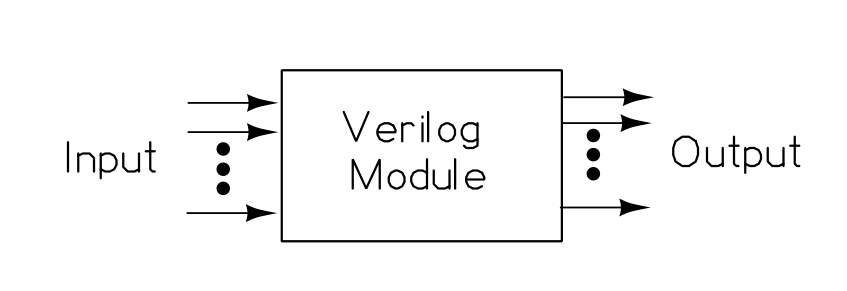
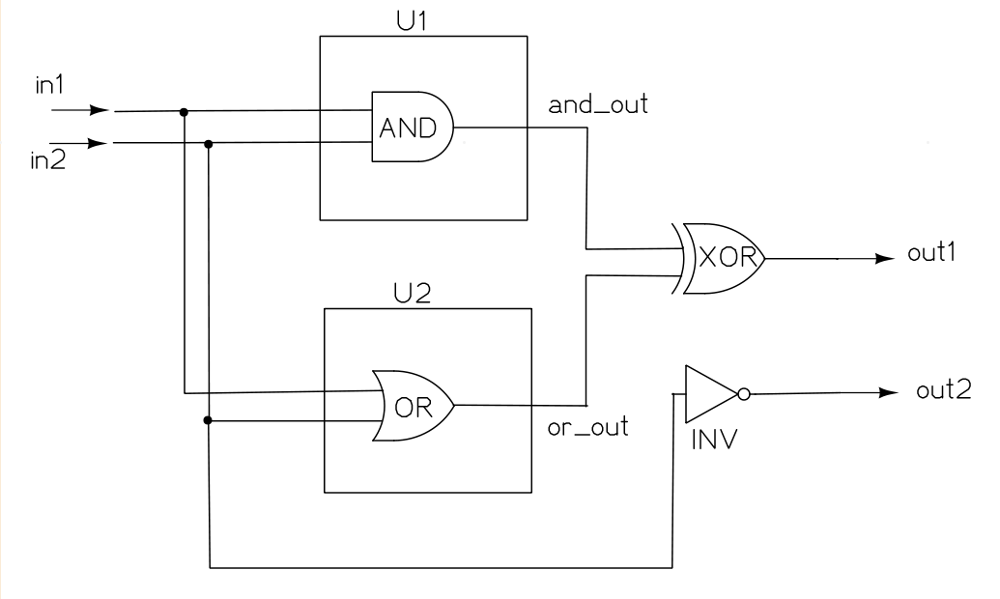
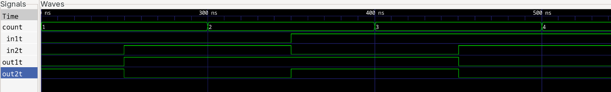

import TawkWidget from '../../../../components/TawkWidget.astro';
import UniversalContentContributors from '../../../../components/UniversalContentContributors.astro';
import InArticleAd from '../../../../components/InArticleAd.astro';
import Copyright from '../../../../components/Copyright.astro';
import BionicText from '../../../../components/BionicText.astro';
import TailwindWrapper from '../../../../components/TailwindWrapper.jsx';
import { Tabs, TabItem } from '@astrojs/starlight/components';
import { Card, CardGrid, Badge, Steps, LinkButton, FileTree } from '@astrojs/starlight/components';

<UniversalContentContributors 
  contributors={frontmatter.contributors}
/>


import FpgaDigitalDesignVerilogComments from '../../../../components/fpga-digital-design-verilog/FpgaDigitalDesignVerilogComments.astro';

A microcontroller runs instructions one after another. The hardware inside it does not: every gate settles at once, in parallel. Verilog is a language for describing that parallel hardware. This lesson covers the smallest set of Verilog you need to describe real circuits, and ends with logic you can simulate on your own machine with no board required. #verilog #hdl #digitaldesign

{/* CONTRIBUTOR NOTE
   Goal of this lesson: get the reader writing and simulating Verilog with zero hardware.
   Keep every section heading below. Fill the body with explanation, runnable code, and at least
   one worked Application Question. Follow the format in /education/digital-electronics/.
   Rules: no em dashes; minimal emojis; no `$` for currency (write "30 USD"); code blocks need a
   title attribute; keep large code blocks OUT of <Steps> (it breaks MDX); avoid `<=` inside tables.
*/}

## Learning Objectives

By the end of this lesson, you will be able to:

1. **Write** a Verilog module with input and output ports.
2. **Distinguish** combinational logic from sequential logic and choose `wire` versus `reg` correctly.
3. **Apply** the blocking (`=`) versus non-blocking (`<=`) rule and explain why it matters.
4. **Simulate** a design with Icarus Verilog and confirm it against a truth table.

## What We Are Building

<InArticleAd />


<Card title="Logic gates and a 4-bit adder in Verilog" icon="star">
  You will recreate the AND, OR, NOT, and XOR gates you built physically in Digital Electronics, this time as Verilog modules, then compose them into a 4-bit ripple-carry adder and simulate the whole thing.
</Card>

**Tools used in this lesson:**

| Tool | Purpose |
|------|---------|
| Icarus Verilog (`iverilog`) | Compile and simulate Verilog |
| GTKWave | View simulation waveforms |

{/* CONTRIBUTOR: add a short install note per OS (Linux, macOS, Windows) or link to the toolchain setup section that Lesson 4 will own. No hardware in this lesson. */}

## From Schematic to Source: The Module

<InArticleAd />


{/* CONTRIBUTOR: introduce the `module ... endmodule` block, port declarations, and how a module maps
   to a reusable hardware block. Show the smallest possible example first. */}

```verilog title="and_gate.v"
module and_gate (
    input  wire a,
    input  wire b,
    output wire y
);
    assign y = a & b;
endmodule
```

## Wires versus Registers

<InArticleAd />


{/* CONTRIBUTOR: explain `wire` (driven continuously, combinational) versus `reg` (holds a value,
   assigned in procedural blocks). Stress that `reg` does NOT always mean a hardware register. */}

## Combinational Logic: `assign` and `always @(*)`

<InArticleAd />


{/* CONTRIBUTOR: cover continuous assignment and the combinational always block. Recreate OR, NOT, XOR.
   Build the 4-bit adder here. */}

## Sequential Logic: `always @(posedge clk)`

<InArticleAd />


{/* CONTRIBUTOR: introduce the clocked always block and the idea of state that updates on a clock edge.
   Keep it light; Lesson 3 goes deep on sequential design. */}

## The Blocking versus Non-Blocking Rule

<InArticleAd />


{/* CONTRIBUTOR: the single most common beginner bug. State the rule plainly:
   use `=` (blocking) in combinational always blocks, use `<=` (non-blocking) in clocked always blocks.
   Show a before/after example of the bug it causes. */}

## Application Questions and Solutions

<InArticleAd />


{/* CONTRIBUTOR: this is the worked-example format borrowed from /education/planar-mechanics/.
   Pose a concrete question, then hide the full solution in a <details> block using <Steps>.
   Add two or three of these per lesson. One stub is provided below as the pattern to follow. */}

### Question 1: Build a 2-to-1 multiplexer

Write a Verilog module for a 2-to-1 multiplexer with inputs `a`, `b`, a select line `sel`, and output `y`, then describe how you would confirm it works.

<details>
<summary>**Click to reveal the solution**</summary>

<Steps>

1. **Declare the module and ports.** One output `y`, three inputs `a`, `b`, `sel`. ✅

2. **Describe the logic.** A multiplexer passes `a` when `sel` is 0 and `b` when `sel` is 1. ✅

3. **Confirm against the truth table** in simulation for all four combinations of `sel` and the chosen input. ✅

</Steps>

```verilog title="mux2.v"
module mux2 (
    input  wire a,
    input  wire b,
    input  wire sel,
    output wire y
);
    assign y = sel ? b : a;
endmodule
```

</details>

## Summary

<InArticleAd />


| Concept | Key Takeaway |
|---------|--------------|
| Module | The reusable unit of hardware, with declared input and output ports |
| `wire` versus `reg` | `wire` for continuous combinational drive, `reg` for values assigned in procedural blocks |
| Combinational versus sequential | Combinational settles immediately, sequential updates on a clock edge |
| Blocking versus non-blocking | `=` in combinational blocks, `<=` in clocked blocks |

{/* CONTRIBUTOR: close with a short paragraph linking forward, then keep the Next Lesson tip below. */}

:::tip[Next Lesson]
In [Lesson 2: Simulation and Testbenches](/education/fpga-digital-design-verilog/simulation-and-testbenches), you will write a self-checking testbench for the adder you built here and learn to read its behaviour in a waveform viewer, so a design is proven correct before it ever reaches a board.
:::

<FpgaDigitalDesignVerilogComments />


<InArticleAd />
<TawkWidget />
<Copyright />


#  Verilog HDL Tutorial

### A Complete Guide to Hardware Description Languages and Digital Design

---

##  Table of Contents

- [Installation Guide](#installation-guide)
- [Introduction to HDLs](#introduction-to-hdls)
- [Verilog HDL](#verilog-hdl)
- [Fundamentals of Verilog](#fundamentals-of-verilog)
- [Methods of Modeling](#methods-of-modeling)
- [Hierarchical Module Representation](#hierarchical-module-representation)
- [Testbench Formation](#testbench-formation)
- [Designing a 4-Bit Counter](#designing-a-4-bit-counter)

---

## Installation Guide for softwares used in RTL

### Installing VS Code, Icarus Verilog and GTKWave on Linux (Fedora)

```bash
# Update system
sudo dnf update

# Install VS Code
# Import the Microsoft GPG key
sudo rpm --import https://packages.microsoft.com/keys/microsoft.asc

# Create the repository file
sudo sh -c 'echo -e "[code]\nname=Visual Studio Code\nbaseurl=https://packages.microsoft.com/yumrepos/vscode\nenabled=1\ngpgcheck=1\ngpgkey=https://packages.microsoft.com/keys/microsoft.asc" > /etc/yum.repos.d/vscode.repo'

# Install VS Code
sudo dnf install code

# Install Icarus Verilog
sudo dnf install iverilog

# Install GTKWave
sudo dnf install gtkwave
```

---

## Introduction to Hardware Descriptive Language (HDL)

### What is an HDL?

**Hardware Description Language (HDL)** is a specialized programming language used to describe the structure, design, and operation of digital and electronic systems.

HDLs help us formalize and represent a digital system. 
They are used for designing processors, motherboards, CPUs, and various other digital circuits.

### Purpose of HDLs

| **Purpose** | **Description** |
| :--- | :--- |
| **Circuit Design** | Provides a way to design digital circuits that meet specifications |
| **Simulation** | Helps test and verify circuits before physical implementation |
| **Synthesis** | Converts HDL code into gate-level netlists for fabrication |
| **Timing Analysis** | Analyzes timing behavior to ensure timing requirements are met |

### Types of HDLs

There are several HDLs available:

1. **VHDL** (Very High-speed Integrated Circuit HDL)
2. **Verilog**
3. **SystemVerilog**

**In this course, we will focus on Verilog HDL.**

---

## Verilog HDL
**Verilog** is a hardware description language that is used to realize the digital circuits through code. 

### History

Verilog was developed by **Gateway Design Automation** as a proprietary language for logic simulation in **1984**.

### Applications

Verilog HDL is commonly used for:

| **Application** | **Description** |
| :--- | :--- |
| **RTL Design** | Register Transfer Level design of digital circuits |
| **Verification** | Writing testbenches to validate designs |
| **FPGA Implementation** | Programming Field Programmable Gate Arrays |
| **ASIC Design** | Designing Application-Specific Integrated Circuits |

### Register Transfer Level (RTL)

**Register Transfer Level (RTL)** is a low-level abstraction used in digital design to describe the behavior and functionality of a digital circuit or system.

---

## Fundamentals of Verilog

### Module Representation

Everything in Verilog is built inside a **module**. A module contains input pins, output pins, and internal logic.



*Figure: Verilog Module Structure*
Gates, multiplexers, and priority circuits are all examples of hardware modules.

#### Module Syntax

```verilog
module <module_name> (<port_list>);

    // Port definitions
    // Description of the digital system
    statement 1;
    statement 2;
    statement 3;
    ...

endmodule
```

#### Important Rules

| **Rule** | **Description** |
| :--- | :--- |
| **1** | Module name must be unique and not match any Verilog keywords |
| **2** | Module must have input and output ports |
| **3** | Port elements are defined within the module |
| **4** | Module must be closed with `endmodule` |
| **5** | Use `//` for comments |

#### Example

```verilog
module first_system (out1, out2, in1, in2);

    // Port definitions
    input  in1, in2;
    output out1, out2;
    
    // Description of the digital system
    and gate_and (out1, in1, in2);
    or  gate_or  (out2, in1, in2);

endmodule
```

---

## Methods of Modeling

There are three different styles for describing module functionality in Verilog:

1. **Structural Modeling**
2. **Dataflow Modeling**
3. **Behavioral Modeling**

---

### Structural Modeling

In structural modeling, each element to be used in the description statement should have been defined under Verilog as a structure. Since logic gates are extensively used in Verilog descriptions, they have been defined beforehand.

This description method is also called **gate-level modeling**.

**Syntax:**

```verilog
gate_keyword name (port_list)
```

#### Example

Building AND, OR, XOR, and NOT gates using Verilog:

```verilog
module first_system (out1, out2, in1, in2);

    // Port Definitions
    input  in1, in2;
    output out1, out2;

    // Internal Signals
    wire and_out, or_out;

    // Structural Modeling
    and gate_and (and_out, in1, in2);
    or  gate_or  (or_out,  in1, in2);
    xor gate_xor (out1,   and_out, or_out);
    not gate_not (out2,   in2);

endmodule
```

---

### Dataflow Modeling

In this method, the relation between input and output ports is formed as a function.

The main keyword in dataflow modeling is **`assign`**.

**Syntax:**

```verilog
assign output = function_of_inputs;
```

Functions may be formed by logic gate representations. Operators used in dataflow modeling are: `&`, `|`, `~`, `^`

#### Example

Building AND, OR, XOR, and NOT gates using Verilog:

```verilog
module first_system (out1, out2, in1, in2);

    // Port Definitions
    input  in1, in2;
    output out1, out2;

    // Internal Signals
    wire and_out, or_out;

    // Dataflow Modeling
    assign and_out = in1 & in2;
    assign or_out  = in1 | in2;
    assign out1    = and_out ^ or_out;
    assign out2    = ~in2;

endmodule
```

#### Truth Table

| `in1` | `in2` | `and_out` | `or_out` | `out1` (XOR) | `out2` (NOT) |
| :---: | :---: | :---: | :---: | :---: | :---: |
| 0 | 0 | 0 | 0 | 0 | 1 |
| 0 | 1 | 0 | 1 | 1 | 0 |
| 1 | 0 | 0 | 1 | 1 | 1 |
| 1 | 1 | 1 | 1 | 0 | 0 |

---

### Behavioral Modeling

In this method, the digital system at hand is represented by its **behavior**. It describes a circuit's behavior or functionality using procedural blocks.

In behavioral modeling, statements to be executed should be triggered by a signal to operate. The keyword **`always`** is used to indicate this triggering operation.

If there is more than one statement to be executed, they should be encapsulated by `begin` and `end` keywords.

**Syntax:**

```verilog
always @ (sensitivity_list)  // Triggering signal
begin
    // behavioral description
    statement 1;
    statement 2;
    statement 3;
    ...
end
```

#### Example

```verilog
module first_system (out1, out2, in1, in2);

    // Port Definitions
    input  in1, in2;
    output out1, out2;

    // Internal Signals
    reg out1, out2;

    // Initialization
    initial begin
        out1 = 0;
        out2 = 0;
    end

    // Behavioral Modeling
    always @ (in1, in2) begin
        out1 = (in1 & in2) ^ (in1 | in2);
        out2 = ~in2;
    end

endmodule
```

---

## Hierarchical Module Representation

In larger projects, the number of modules may be more than one. In the example below, we represent our system as a combination of three modules such that AND and OR gates are described in different modules.

*Figure: Hierarchical Module Structure*

### AND Module

```verilog
module and_module (and_out, in1, in2);

    // Port Definitions
    input  in1, in2;
    output and_out;

    // Dataflow Modeling
    assign and_out = in1 & in2;

endmodule
```

### OR Module

```verilog
module or_module (or_out, in1, in2);

    // Port Definitions
    input  in1, in2;
    output or_out;

    // Dataflow Modeling
    assign or_out = in1 | in2;

endmodule
```

### Top-Level Module

```verilog
module first_system (out1, out2, in1, in2);

    // Port Definitions
    input  in1, in2;
    output out1, out2;

    // Internal Signals
    wire and_out, or_out;

    // Structural Modeling
    and_module U1 (and_out, in1, in2);
    or_module  U2 (or_out,  in1, in2);

    // Dataflow Modeling
    assign out1 = and_out ^ or_out;
    assign out2 = ~in2;

endmodule
```

---

## Testbench Formation

A **testbench** is a special Verilog module that is used to **test and verify** another module.

### Structure of a Verilog Testbench

1. Testbench module declaration
2. Input/output port declaration
3. Instantiation of the Unit Under Test (UUT)
4. Providing input to the UUT
5. Displaying the test results

---

### First System Module

```verilog
module first_system (out1, out2, in1, in2);

    // Port Definitions
    input  in1, in2;
    output out1, out2;

    // Internal Signals
    reg out1, out2;

    // Initialization
    initial begin
        out1 = 0;
        out2 = 0;
    end

    // Behavioral Modeling
    always @ (in1, in2) begin
        out1 = (in1 & in2) ^ (in1 | in2);
        out2 = ~in2;
    end

endmodule
```

---

### Testbench File

```verilog
`timescale 1ns/1ps
`include "first_system.v"

module first_system_tb;

// Inputs
reg in1t, in2t;

// Outputs
wire out1t, out2t;

// Instantiate the Unit Under Test (UUT)
first_system UUT (
    .out1(out1t), 
    .out2(out2t),
    .in1(in1t),
    .in2(in2t)
);

reg [1:0] Testset [3:0];

integer count;

// Providing input to the UUT
initial begin
    // Create VCD file for waveform viewing
    $dumpfile("first_system.vcd");
    $dumpvars(0, first_system_tb);

    // Initialize test vectors
    Testset[0] = 2'b00;
    Testset[1] = 2'b01;
    Testset[2] = 2'b10;
    Testset[3] = 2'b11;

    #100;

    count = 0;
    repeat (4)
    begin
        #50 {in1t, in2t} = Testset[count];
        #50 count = count + 1;
    end

    #50 $finish;
end

// Display the result on the console (Optional)
initial begin
    $display("================================");
    $display("  in1  in2  |  out1  out2");
    $display("================================");
    $monitor("  %b    %b    |   %b     %b", in1t, in2t, out1t, out2t);
end

endmodule
```

### Simulation Results

| `in1` | `in2` | `out1` | `out2` |
| :---: | :---: | :---: | :---: |
| 0 | 0 | 0 | 1 |
| 0 | 1 | 1 | 0 |
| 1 | 0 | 1 | 1 |
| 1 | 1 | 0 | 0 |

---

## Designing a 4-Bit Counter

A **4-bit counter** is a sequential circuit that counts from 0 to 15 (binary 0000 to 1111).

### Inputs
- `clk` - Clock signal (triggers counting)
- `reset` - Reset signal (sets count to 0)

### Outputs
- `count[3:0]` - 4-bit output (counts from 0 to 15)

---

### Counter Module

```verilog
module counter_4bit (
    input wire clk,
    input wire reset,
    output reg [3:0] count
);

    always @(posedge clk or posedge reset) begin
        if (reset)
            count <= 4'b0000;
        else
            count <= count + 1;
    end

endmodule
```

---

### Counter Testbench

```verilog
`timescale 1ns/1ps
`include "counter_4bit.v"

module counter_4bit_tb;

    reg clk;
    reg reset;
    wire [3:0] count;

    // Instantiate the counter
    counter_4bit uut (
        .clk(clk),
        .reset(reset),
        .count(count)
    );

    // Clock generation
    initial begin
        clk = 0;
        forever #5 clk = ~clk;  // 10ns period (100MHz)
    end

    // Test sequence
    initial begin
        // Create VCD file for waveform viewing
        $dumpfile("counter_4bit.vcd");
        $dumpvars(0, counter_4bit_tb);
        
        // Initialize
        reset = 1;
        #20;
        
        // Release reset and let counter run
        reset = 0;
        #200;
        
        // Apply reset again
        reset = 1;
        #20;
        reset = 0;
        #100;
        
        // End simulation
        $finish;
    end

    // Monitor output
    initial begin
        $monitor("Time=%0t reset=%b count=%d", $time, reset, count);
    end

endmodule
```




*Figure: Counter Output*
---
## 🚀 Simulation Commands

```bash
# Compile
iverilog -o design_tb.vvp design.v design_tb.v

# Run
vvp design_tb.vvp

# View waveforms
gtkwave design.vcd
```

---


