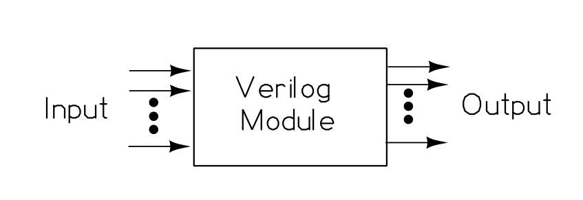
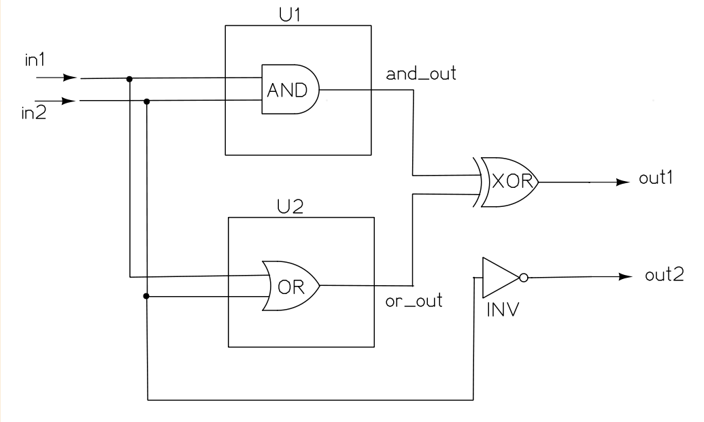

import TawkWidget from '../../../../components/TawkWidget.astro';
import UniversalContentContributors from '../../../../components/UniversalContentContributors.astro';
import InArticleAd from '../../../../components/InArticleAd.astro';
import Copyright from '../../../../components/Copyright.astro';
import BionicText from '../../../../components/BionicText.astro';
import TailwindWrapper from '../../../../components/TailwindWrapper.jsx';
import { Tabs, TabItem } from '@astrojs/starlight/components';
import { Card, CardGrid, Badge, Steps, LinkButton, FileTree } from '@astrojs/starlight/components';

<UniversalContentContributors 
  contributors={frontmatter.contributors}
/>


import FpgaDigitalDesignVerilogComments from '../../../../components/fpga-digital-design-verilog/FpgaDigitalDesignVerilogComments.astro';

A microcontroller runs your instructions one after another, however fast the clock. Verilog does something else entirely: it describes hardware, and hardware does everything at the same time. That single difference is what trips up almost every programmer who comes to it, and it is what this lesson exists to fix. #verilog #hdl #digitaldesign

## Learning Objectives

By the end of this lesson, you will be able to:

1. **Write** a Verilog module with input and output ports, and explain what it becomes in gates.
2. **Distinguish** combinational logic from sequential logic and choose `wire` versus `reg` correctly.
3. **Describe** the same circuit three ways, structurally, in dataflow, and behaviourally, and say when each is appropriate.
4. **Apply** the blocking (`=`) versus non-blocking (`<=`) rule and explain the bug it prevents.
5. **Compose** small modules into a larger design using hierarchy.
6. **Simulate** a design with Icarus Verilog and confirm it against a truth table.

## What We Are Building

<InArticleAd />


<Card title="Logic gates, a 4-bit adder, and a counter" icon="star">
  You will recreate the AND, OR, NOT, and XOR gates you built physically in Digital Electronics, this time as Verilog modules. Then you will compose them into a 4-bit ripple-carry adder, write a counter that advances on a clock edge, and simulate all of it without touching a board.
</Card>

**Tools used in this lesson:**

| Tool | Purpose |
|------|---------|
| Icarus Verilog (`iverilog`) | Compile and simulate Verilog |
| GTKWave | View simulation waveforms |
| A text editor | VS Code with a Verilog extension is fine, so is anything else |

No hardware is needed. You will not need an FPGA board until Lesson 4.

### Installing the Tools

<Tabs>
<TabItem label="Ubuntu / Debian">

```bash title="Install on Ubuntu or Debian"
sudo apt update
sudo apt install iverilog gtkwave
```

</TabItem>
<TabItem label="Fedora">

```bash title="Install on Fedora"
sudo dnf install iverilog gtkwave
```

</TabItem>
<TabItem label="macOS">

```bash title="Install on macOS with Homebrew"
brew install icarus-verilog
brew install --cask gtkwave
```

</TabItem>
<TabItem label="Windows">

```powershell title="Install on Windows"
# Easiest route: install both from the iverilog Windows bundle
winget install --id IcarusVerilog.IcarusVerilog

# Or use WSL2 and follow the Ubuntu instructions above,
# which is the smoother path if you plan to reach Lesson 9.
```

</TabItem>
</Tabs>

Check that both work before going further:

```bash title="Verify the install"
iverilog -V
gtkwave --version
```

## Why a Hardware Description Language

<InArticleAd />


A program is a list of steps. A circuit is a shape. An HDL exists because you need a text file that describes a shape, not a sequence, and because that description has to be precise enough for a tool to turn into real gates.

Verilog does three jobs at once:

- **It documents the design** in a form another engineer can read.
- **It simulates**, so you can prove the design behaves correctly before committing it to anything physical.
- **It synthesises**, meaning a tool reads it and produces an actual arrangement of gates and flip-flops.

That third job is the one with teeth. Anything you write has to be something hardware can physically be, and a good deal of legal Verilog is not synthesisable at all. Simulation will happily run a delay like `#50`, but no gate on earth implements "wait fifty nanoseconds."

The level you will write at is called **RTL**, or register transfer level. The name is literal: you describe what combinational logic sits between the registers, and what moves from one register to the next on each clock edge. Get comfortable thinking in those terms and the rest of the course follows.

Verilog was created by Gateway Design Automation in the 1980s, became an IEEE standard, and remains one of the two dominant HDLs alongside VHDL. This course uses Verilog throughout.

## From Schematic to Source: The Module

<InArticleAd />


Everything in Verilog lives inside a **module**. A module has input ports, output ports, and logic in between. It is the unit of reuse, the same way a chip on a breadboard is: you wire up its pins and you do not care what is inside until you need to.



*Figure: a module is a block with declared ports and internal logic*

Here is the smallest useful one, a single AND gate:

```verilog title="and_gate.v"
module and_gate (
    input  wire a,
    input  wire b,
    output wire y
);
    assign y = a & b;
endmodule
```

Read it as a wiring instruction, not an instruction to execute. It says: there is a block called `and_gate`, it has two input pins and one output pin, and the output pin is permanently driven by the AND of the two inputs. There is no "when" about it. Change `a` and `y` follows, as fast as the gate can manage.

### Module Syntax

```verilog title="General form"
module <module_name> (<port_list>);

    // Port definitions
    // Description of the digital system
    statement 1;
    statement 2;
    ...

endmodule
```

### Rules Worth Remembering

| Rule | Description |
| :--- | :--- |
| 1 | The module name must be unique and must not clash with a Verilog keyword |
| 2 | Ports are how the module connects to the outside world |
| 3 | Port directions are declared inside the module |
| 4 | Every module closes with `endmodule` |
| 5 | Comments use `//` for one line, `/* */` for several |

Ports can be declared in the header, as in `and_gate` above, or listed and then declared separately. Both are common, and you will meet both in real code:

```verilog title="first_system.v, ports declared separately"
module first_system (out1, out2, in1, in2);

    // Port definitions
    input  in1, in2;
    output out1, out2;

    // Description of the digital system
    and gate_and (out1, in1, in2);
    or  gate_or  (out2, in1, in2);

endmodule
```

## Wires versus Registers

<InArticleAd />


Verilog gives you two ways to hold a value, and the names are actively misleading. Learn them once, properly, and a whole class of confusion disappears.

| Type | What it means | Where you assign it |
|------|---------------|---------------------|
| `wire` | A connection that is continuously driven by something else | `assign` statements, or a module's output port |
| `reg` | A variable that keeps its value until something changes it | Inside `always` or `initial` blocks |

The trap: **`reg` does not mean "this becomes a hardware register."** It is a simulation storage type, nothing more. A `reg` assigned inside `always @(*)` synthesises to plain combinational logic with no flip-flop anywhere. A `reg` assigned inside `always @(posedge clk)` does become a flip-flop. The clock decides, not the keyword.

The practical rule is simply mechanical:

- Driving something with `assign`? Declare it `wire`.
- Driving something inside an `always` block? Declare it `reg`.

Get it wrong and the compiler tells you immediately, so this is a cheap mistake rather than an expensive one.

## Three Ways to Describe the Same Hardware

<InArticleAd />


Verilog offers three modelling styles. They are not three different circuits, they are three ways of writing down the same one, and mixing them inside a single module is normal practice.

### Structural Modelling

You name the gates and wire them together yourself. Verilog has gate primitives built in, so `and`, `or`, `xor` and `not` are keywords you can instantiate directly. This is also called gate-level modelling.

```verilog title="Syntax"
gate_keyword instance_name (output, input1, input2, ...);
```

Note that the output comes first in the port list of a gate primitive.

```verilog title="first_system.v, structural"
module first_system (out1, out2, in1, in2);

    // Port Definitions
    input  in1, in2;
    output out1, out2;

    // Internal Signals
    wire and_out, or_out;

    // Structural Modeling
    and gate_and (and_out, in1, in2);
    or  gate_or  (or_out,  in1, in2);
    xor gate_xor (out1,   and_out, or_out);
    not gate_not (out2,   in2);

endmodule
```

This style is closest to a schematic, which makes it good for learning and tedious for anything large. Nobody builds a CPU this way.

### Dataflow Modelling

You write the output as a function of the inputs and let the tool choose the gates. The keyword is `assign`, and the operators are the ones you would expect: `&` for AND, `|` for OR, `~` for NOT, `^` for XOR.

```verilog title="Syntax"
assign output = function_of_inputs;
```

```verilog title="first_system.v, dataflow"
module first_system (out1, out2, in1, in2);

    // Port Definitions
    input  in1, in2;
    output out1, out2;

    // Internal Signals
    wire and_out, or_out;

    // Dataflow Modeling
    assign and_out = in1 & in2;
    assign or_out  = in1 | in2;
    assign out1    = and_out ^ or_out;
    assign out2    = ~in2;

endmodule
```

Both versions above produce identical hardware. Here is what they compute:

| `in1` | `in2` | `and_out` | `or_out` | `out1` (XOR) | `out2` (NOT) |
| :---: | :---: | :---: | :---: | :---: | :---: |
| 0 | 0 | 0 | 0 | 0 | 1 |
| 0 | 1 | 0 | 1 | 1 | 0 |
| 1 | 0 | 0 | 1 | 1 | 1 |
| 1 | 1 | 1 | 1 | 0 | 0 |

Dataflow is where most real combinational logic gets written. It is concise and it says what you mean.

### Behavioural Modelling

You describe what the circuit does, inside a procedural block, and let the tool work out the structure. The keyword is `always`, followed by a sensitivity list saying what should retrigger it. More than one statement needs `begin` and `end`.

```verilog title="Syntax"
always @ (sensitivity_list)
begin
    statement 1;
    statement 2;
    ...
end
```

```verilog title="first_system.v, behavioural"
module first_system (out1, out2, in1, in2);

    // Port Definitions
    input  in1, in2;
    output out1, out2;

    // Internal Signals
    reg out1, out2;

    // Behavioral Modeling
    always @ (in1, in2) begin
        out1 = (in1 & in2) ^ (in1 | in2);
        out2 = ~in2;
    end

endmodule
```

Notice `out1` and `out2` are now `reg`, because they are assigned inside an `always` block. The hardware is still pure combinational logic. No clock appears anywhere, so no flip-flop is created.

Writing `always @ (in1, in2)` means "re-evaluate whenever `in1` or `in2` changes." Forgetting a signal from that list is a classic bug: simulation goes stale while the synthesised hardware does the right thing, so the two disagree. Modern practice avoids the whole problem by writing `always @(*)`, which asks the tool to work out the list for you:

```verilog title="Prefer this for combinational blocks"
always @(*) begin
    out1 = (in1 & in2) ^ (in1 | in2);
    out2 = ~in2;
end
```

Use `always @(*)` for combinational logic from here on.

## Combinational Logic in Practice: a 4-Bit Adder

<InArticleAd />


Time to build something with a carry chain. A full adder takes two bits and a carry in, and produces a sum bit and a carry out:

```verilog title="full_adder.v"
module full_adder (
    input  wire a,
    input  wire b,
    input  wire cin,
    output wire sum,
    output wire cout
);
    assign sum  = a ^ b ^ cin;
    assign cout = (a & b) | (cin & (a ^ b));
endmodule
```

Chain four of them and the carry ripples from one stage to the next, exactly as it does when you add on paper:

```verilog title="adder4.v"
module adder4 (
    input  wire [3:0] a,
    input  wire [3:0] b,
    input  wire       cin,
    output wire [3:0] sum,
    output wire       cout
);
    wire c1, c2, c3;

    full_adder fa0 (.a(a[0]), .b(b[0]), .cin(cin), .sum(sum[0]), .cout(c1));
    full_adder fa1 (.a(a[1]), .b(b[1]), .cin(c1),  .sum(sum[1]), .cout(c2));
    full_adder fa2 (.a(a[2]), .b(b[2]), .cin(c2),  .sum(sum[2]), .cout(c3));
    full_adder fa3 (.a(a[3]), .b(b[3]), .cin(c3),  .sum(sum[3]), .cout(cout));
endmodule
```

Two things to notice. First, `[3:0]` declares a four-bit bus, and `a[0]` picks one bit out of it. Second, the instantiations use **named port connection** (`.a(a[0])`) rather than relying on position. Named connections are longer to type and save you from a whole category of silent wiring mistakes. Use them.

You could also have written the entire adder as `assign {cout, sum} = a + b + cin;` and the tool would build you something better optimised. The point of doing it the long way once is that you now know what `+` actually costs: four gate delays stacked end to end, which is exactly why wide ripple-carry adders are slow.

## Sequential Logic: `always @(posedge clk)`

<InArticleAd />


Everything so far settles on its own. Sequential logic is different: it remembers, and it changes only when the clock edge arrives. That is a flip-flop, and it is the other half of RTL.

```verilog title="counter_4bit.v"
module counter_4bit (
    input  wire clk,
    input  wire reset,
    output reg  [3:0] count
);

    always @(posedge clk or posedge reset) begin
        if (reset)
            count <= 4'b0000;
        else
            count <= count + 1;
    end

endmodule
```

Read the sensitivity list carefully. `posedge clk` means the block runs on the rising edge of the clock. Adding `or posedge reset` makes the reset **asynchronous**: it takes effect the moment it is asserted, without waiting for a clock edge.

`count <= count + 1` is the line that makes this a counter. It says: whatever `count` is now, make it one greater at the next edge. Four flip-flops hold the value, and an adder sits between them computing the next one. That is the register transfer the name RTL refers to.

`4'b0000` is a sized literal: four bits, binary, all zero. You will also see `4'd0` for decimal and `4'hF` for hex. Get in the habit of sizing your literals, because unsized ones default to 32 bits and cause quiet truncation warnings.

Note also that `count` overflows silently from `4'b1111` back to `4'b0000`. Four bits cannot hold sixteen, so it wraps. That is not a bug, it is arithmetic, but it is the kind of thing you have to decide about deliberately in hardware.

## The Blocking versus Non-Blocking Rule

<InArticleAd />


This is the single most common beginner bug in Verilog, and it is worth learning as a rule before you understand the theory.

**The rule:** use `=` in combinational `always` blocks, use `<=` in clocked `always` blocks.

That is it. Follow it and you will avoid the problem entirely. Here is why it exists.

`=` is **blocking**: statements take effect immediately and in order, like lines in a normal program. `<=` is **non-blocking**: the right-hand sides are all evaluated first, then every left-hand side updates together at the end of the time step.

Consider a two-stage shift register, where `a` should move to `b` and `b` to `c` on each edge. Written correctly:

```verilog title="Correct: non-blocking in a clocked block"
always @(posedge clk) begin
    b <= a;
    c <= b;
end
```

Both right-hand sides are sampled before anything updates, so `c` receives the **old** `b`. Two flip-flops, data marching along one stage per clock. Exactly what hardware does.

Now the same thing with blocking assignments:

```verilog title="Wrong: blocking in a clocked block"
always @(posedge clk) begin
    b = a;
    c = b;
end
```

The first line executes and `b` is already `a`. The second line then copies that new value into `c`. So `a` reaches `c` in a single clock, and your two-stage shift register has collapsed into one stage. The hardware the tool synthesises may not even match what the simulator showed you, which is the worst kind of bug: it disappears when you look for it in one place and reappears in the other.

Keep to the rule and the question never comes up.

## Building Bigger: Hierarchical Modules

<InArticleAd />


Real designs are modules inside modules. You saw this already with the adder, where `adder4` instantiated four copies of `full_adder`. The same idea applies at every scale, right up to the mini CPU you will build in Lesson 7.



*Figure: a top-level module built from two smaller ones*

Split the AND and OR into their own modules:

```verilog title="and_module.v"
module and_module (and_out, in1, in2);

    // Port Definitions
    input  in1, in2;
    output and_out;

    // Dataflow Modeling
    assign and_out = in1 & in2;

endmodule
```

```verilog title="or_module.v"
module or_module (or_out, in1, in2);

    // Port Definitions
    input  in1, in2;
    output or_out;

    // Dataflow Modeling
    assign or_out = in1 | in2;

endmodule
```

Then wire them together in a parent, mixing structural instantiation with dataflow for the rest:

```verilog title="first_system.v, hierarchical"
module first_system (out1, out2, in1, in2);

    // Port Definitions
    input  in1, in2;
    output out1, out2;

    // Internal Signals
    wire and_out, or_out;

    // Structural Modeling: instantiate the submodules
    and_module U1 (and_out, in1, in2);
    or_module  U2 (or_out,  in1, in2);

    // Dataflow Modeling for the rest
    assign out1 = and_out ^ or_out;
    assign out2 = ~in2;

endmodule
```

`U1` and `U2` are instance names. Each instance is a separate physical copy of the logic. Instantiating `and_module` twice gives you two AND gates, not one shared between callers. This is the deepest difference from software: there is no such thing as calling the same function twice to save space. If you want two, you pay for two.

## Running Your First Simulation

<InArticleAd />


Icarus Verilog compiles your design, `vvp` runs it, and GTKWave shows you the result:

```bash title="Compile, run, and view"
# Compile the design and its testbench into a simulation binary
iverilog -o counter_4bit_tb.vvp counter_4bit_tb.v

# Run the simulation
vvp counter_4bit_tb.vvp

# Open the waveform it produced
gtkwave counter_4bit.vcd
```

You need a testbench to give the design inputs, since a module on its own has nothing driving its ports. Writing good testbenches is a skill in itself, and it is the whole subject of Lesson 2. For now, take it on trust that the three commands above are the loop you will run hundreds of times.

## Application Questions and Solutions

<InArticleAd />


### Question 1: Build a 2-to-1 multiplexer

Write a Verilog module for a 2-to-1 multiplexer with inputs `a`, `b`, a select line `sel`, and output `y`, then describe how you would confirm it works.

<details>
<summary>**Click to reveal the solution**</summary>

<Steps>

1. **Declare the module and ports.** One output `y`, three inputs `a`, `b`, `sel`. ✅

2. **Describe the logic.** A multiplexer passes `a` when `sel` is 0 and `b` when `sel` is 1. The conditional operator expresses this directly. ✅

3. **Choose the right type.** `y` is driven by `assign`, so it is a `wire`. ✅

4. **Confirm against the truth table** in simulation for all four combinations of `sel` and the chosen input. ✅

</Steps>

```verilog title="mux2.v"
module mux2 (
    input  wire a,
    input  wire b,
    input  wire sel,
    output wire y
);
    assign y = sel ? b : a;
endmodule
```

</details>

### Question 2: Why does this counter never count?

A student writes the following and reports that `count` stays at zero in simulation. The reset is only asserted at the start. What is wrong, and what is the fix?

```verilog title="broken_counter.v"
module broken_counter (
    input  wire clk,
    input  wire reset,
    output reg  [3:0] count
);
    always @(posedge clk) begin
        if (reset)
            count = 4'b0000;
        count = count + 1;
        count = 4'b0000;
    end
endmodule
```

<details>
<summary>**Click to reveal the solution**</summary>

<Steps>

1. **Trace the block in order.** Blocking assignments execute top to bottom within one clock edge, so the last line always wins. ✅

2. **Identify the effect.** `count` is incremented and then immediately overwritten with zero before the edge finishes, so the increment is never observable. ✅

3. **Recognise the deeper problem.** Assigning the same signal several times in one clocked block is a design smell. A flip-flop has one next-state value, so the code should compute one. ✅

4. **Fix it** by deciding the next value once, in an `if` / `else`, and using non-blocking assignment because this is a clocked block. ✅

</Steps>

```verilog title="fixed_counter.v"
module fixed_counter (
    input  wire clk,
    input  wire reset,
    output reg  [3:0] count
);
    always @(posedge clk) begin
        if (reset)
            count <= 4'b0000;
        else
            count <= count + 1;
    end
endmodule
```

Note this version has a **synchronous** reset, because `reset` is not in the sensitivity list and is only examined on a clock edge. That is usually the better choice on an FPGA, and Lesson 4 explains why.

</details>

### Question 3: How many flip-flops does this create?

```verilog title="how_many.v"
module how_many (
    input  wire clk,
    input  wire [3:0] a,
    input  wire [3:0] b,
    output reg  [3:0] x,
    output reg  [3:0] y
);
    always @(*) begin
        x = a & b;
    end

    always @(posedge clk) begin
        y <= a | b;
    end
endmodule
```

<details>
<summary>**Click to reveal the solution**</summary>

<Steps>

1. **Look at the first block.** It is sensitive to `*`, not to a clock edge, so `x` is combinational despite being declared `reg`. Four AND gates, no storage. ✅

2. **Look at the second block.** It triggers on `posedge clk`, so `y` is registered. Four OR gates feeding four flip-flops. ✅

3. **Count.** Four flip-flops in total, all from the second block. ✅

</Steps>

The answer is four. This is the `reg` trap from earlier: the keyword tells you nothing about whether storage is created. Only the sensitivity list does.

</details>

## Summary

<InArticleAd />


| Concept | Key Takeaway |
|---------|--------------|
| Module | The reusable unit of hardware, with declared input and output ports |
| `wire` versus `reg` | `wire` for continuous drive, `reg` for values assigned in procedural blocks. `reg` does not imply a flip-flop |
| Modelling styles | Structural names the gates, dataflow writes a function, behavioural describes intent. All three synthesise |
| Combinational versus sequential | Combinational settles on its own, sequential updates on a clock edge |
| Blocking versus non-blocking | `=` in combinational blocks, `<=` in clocked blocks. This one rule prevents the most common Verilog bug |
| Hierarchy | Each instance is a separate physical copy. Two instances means twice the gates |
| RTL | Logic between registers, plus what moves on each edge. The level you design at |

You can now describe hardware and you know what your description becomes. What you cannot yet do is prove it correct, and on hardware that matters far more than it does in software, because the feedback loop is so much slower. That is next.

:::tip[Next Lesson]
In [Lesson 2: Simulation and Testbenches](/education/fpga-digital-design-verilog/simulation-and-testbenches), you will wrap the adder and counter from this lesson in self-checking testbenches, learn to read a waveform in GTKWave, and find a deliberately planted bug from its trace alone.
:::

<FpgaDigitalDesignVerilogComments />


<InArticleAd />
<TawkWidget />
<Copyright />